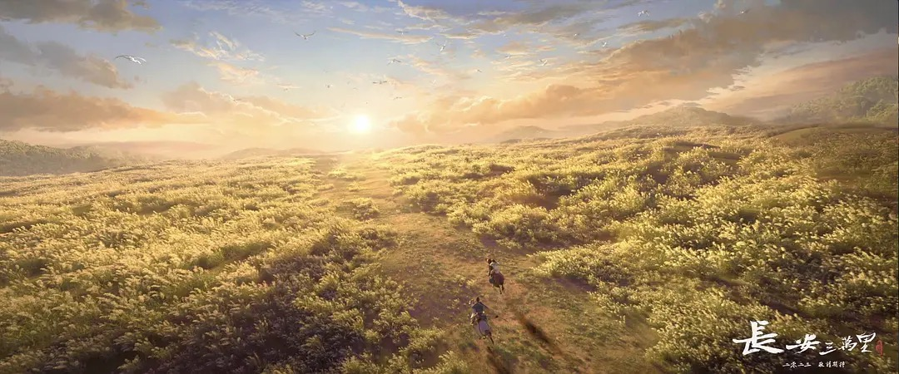
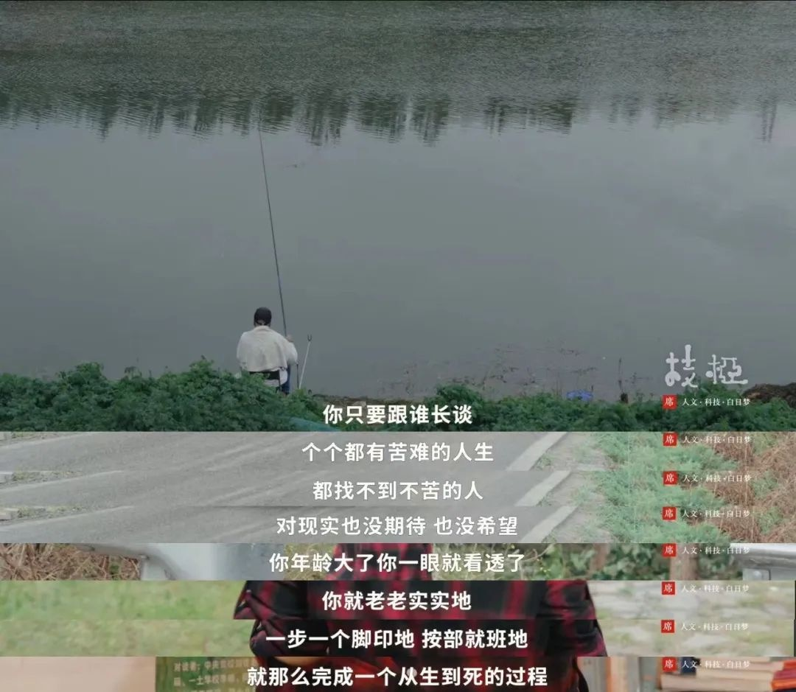

《长安三万里》是一部讲李白和高适之间友谊的动画电影，电影讲述了高李两人少年相识、中年各奔东西、暮年通过种种机缘联系到一起的过程，影片还原了多首脍炙人口的唐诗表现的意境，展现了文化辐射不止三万里的大唐。

高李两人迎着朝阳纵马驰骋的画面是我最喜欢的一个场景，它让我想起了上学时代的一位好友，当年我们经常在小城的旧书摊看霸王书，看完后分享各自心得，相互鼓励...后来我们考上了不同大学和专业，离开家乡，在外面奔波奋斗，忙于生计，彼此之间联系渐少。

在大城市夹缝中生活的我们，快节奏的工作给友谊的空间很小，工作以后建立的情谊相比学生时代更加艰难。我们可能有很多网络上的朋友，生活中的点头之交，职场上熟悉的陌生人，却很少有真正的朋友。

以我有限的观影经验看，以友谊为主题的电影不多，这部电影完美展现了真正的友谊是什么样的。

## 文章

1. [从「下九流」到香港巨商：霍英东](https://www.xiaoyuzhoufm.com/episode/64c12b1399e1e7669e1796b0)

这是「半拿铁 | 商业沉浮录」播客第 61 期的节目，讲述了香港商人霍英东的一生。听之前，在我的印象中，霍是一个很早就与大陆来往密切香港商人，有同事之前买过广州南沙区的房子，提到过南沙基本划给了霍。

听完之后我对他有新的了解。他出生于底层水上人家，年少时父兄不幸去世，留下母亲和几个姐妹相依为命，机缘巧合之下去了香港一家顶尖学校上学，之后学业中断，从事的各种底层的工作都干不长久，后来在亲朋的支持下开了家杂货铺勉强度日。上学给他带来的好处是能看懂英文，他通过报纸得知有一批战后物资拍卖，通过这次拍卖转手后他赚到了人生中的第一桶金。之后买了船与人合作做贸易运输，为了挖一些做药材的海草，他带领船员曾在南海岛屿待了半年多，虽然最后被合伙人坑了没赚到钱，但自经历过海岛残酷生存环境磨练后他信心十足，觉得自己干啥都可以。在大陆被封锁期间，他运输过一些生活物资，别的商人都是漫天要价，他宅心仁厚仅赚了微薄的利润，这也奠定了他之后与大陆建立深厚合作的基础。他观察到香港当时缺房子，就开始盖楼卖楼，期间创新性的使用了卖楼花、房屋宣传册、公摊面积等方法，在房地产行业获利颇丰。后面就是建南沙港，做投资，振兴国家的基建、体育和教育等事业，邓公称赞他做的事业很好。他于 2006 年去世，享年 84 岁。

2. 30岁从大厂裸辞全家搬往英国的故事：[上](https://www.v2ex.com/t/955368)，[中](https://www.v2ex.com/t/956323)，[下](https://www.v2ex.com/t/959091)

这三篇帖子讲述了一位支付宝员工在经历 2022 年上海疫情之后，毅然辞去工作，润去英国伦敦的经历。

帖主和 GF 在市区租房加生活消费每月 3.3w ，伦敦软件工程师税前年收入中位数 78w，算起来也是活得比较拮据。 

在当前经济和就业形势下，作为国内 TOP 大学的博士，在英国找工作也比较困难，贴主半年内投递 472 份简历，28 家给了面试机会，4~5 家走到了最后一轮，收到 1 个 offer。

文章提到了找工作的一个有用技巧：用 chatGPT 来优化简历推荐信，输入岗位描述，让 chatGPT 扮演一个面试官给你提一些问题，让你面试更加有条理。

3. [范雨素：我是那种连生存都不大容易的人，没什么才华，也不算幸运](https://mp.weixin.qq.com/s/YsTifpERTinQZA6qJDj3Ow)

2017 写完[《我是范雨素》](https://zhuanlan.zhihu.com/p/295513463)这篇文章后，作为育儿嫂的范雨素火了一阵，后面又归于沉寂。2021年她根据自己的生活经历写了一本书《久别重逢》。

她的文字坚强而有力量，用平实的语言述说生活的经历，《我是范雨素》这篇文章中用 8000 多字写了自己坎坷的一生。

4. [开了五家店，关了四家店，这是一家二手公司的一手经验](https://mp.weixin.qq.com/s/Yy-1x_CVpCsIW8TQ6luW4w)

多抓鱼创始人讲述开线下店的心路历程，文章很长。如果你有志于开书籍类或服装类线下店，可以看看。

5. [新蓝领的中产故事：你们不知道我有多快乐](https://mp.weixin.qq.com/s/3m7OmyAFHSrywinWHfvpeQ)

我觉得，他们那一代或许是教育的获利者，所以他们很相信学历可以改变命运。但如今的孩子已经很难成为教育的获利者了。到我们这代人，其实大家已经知道，学历正在贬值。从我们这一批人的情况来看，混得最好的人，可能是家境最好的那个，而不是学历最好的。

## 书摘

1. 在这个决不完美的世界上，宗教是个去处。它使做了好事的人有地方去欣喜，做了坏事的人有地方去忏悔；失望的得了希望，绝望的至少得了安慰。信仰是文明的开始。相信，需要天真和勇气——重要的是相信本身，倒不是相信的一定要是什么。只要人尚能相信，这世界就还有救。杀死了天真和勇气，剩下的就是一群暴民了。信仰实在是人性的围墙。--- 《少年凯歌》

2. 在山下不远的人间，真理、道德、秩序却像鱼刺一样苍白、贫瘠、抽象而悖理，我每次在村后小河中洗脚，都会有成群的小鱼啄着我腿上的伤口，使我得了抚慰；我走上山去，用手指触动大株的含羞草，在叶片收拢的瞬间，意识到尊严；一片黄叶，在溪水的转弯处久久盘旋不去，让我懂得了命运。--- 《少年凯歌》

3. 从外在强制下得到的秩序，反而助长了内在的不安。这个事实并不难理解，但是你能否把它应用在生活上，使你的心不再投射任何权威，不论这个权威是书籍、老师、丈夫、妻子、父母、朋友或社团。我们一直都在某种假定的模式下运作，而这个模式就变成了意识形态和权威。如果你能识破“我该怎么做”这个问题背后想建立的一个新的权威，你就彻底结束了你与权威之间的瓜葛。---《重新认识你自己》

4. 只有死于昨日种种，才能使你从内在及外在的所有权威中解脱，你的心才能时时年轻、新鲜、天真无邪、充满热情活力。只有处在这种心境中，人才能观察和学习。要达到这种境界，你需要极大的觉察力，需要对自己内心活动的觉察力。你只是觉察不去纠正，也不指示它什么该做、什么不该做，因为你一纠正它，便树立了另一个权威及督察。---《重新认识你自己》

5. 能够看到自己的本来面目而不与别人相比，就能产生巨大的能量去观察一切。如果你能够观察自己而不带比较，你就已经超越了比较，这并不意味你的心因为自满而停滞不进。因此，认出自心是如何在耗费能量，就是了解整体真相不可或缺的要素。---《重新认识你自己》

