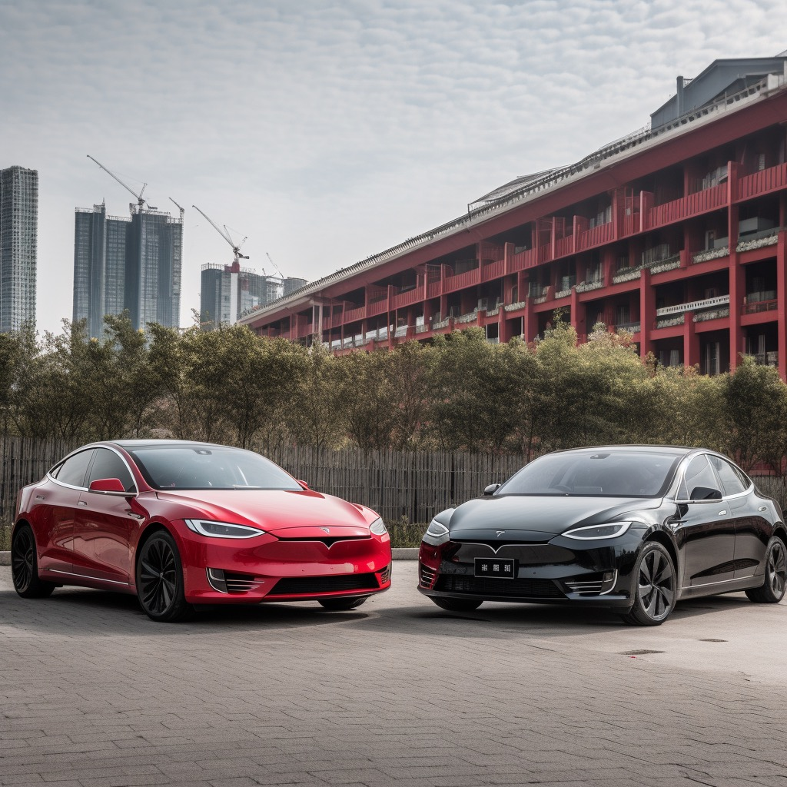

作者：何一涛

日期：2023 年8 月 13 日

涛然自得周刊主要精选作者每周阅读的书影音内容，不定期发布。历史周刊内容可以看[这里](https://github.com/imhet/beyond-code-weekly)。

## 电影

《最后的决斗》，这是一部中世纪的电影，讲述在当时的法国发生的一起轰动全国的决斗事件。这将是法国历史上最后一次决斗。

为避免剧透，这里不赘述细节。总之，这是一部讲女性主义的电影，片中对当时父权社会下的做了深刻的批判，它是中世纪女性的悲歌，也是今时今日女性的悲歌。

引用豆友的评论：哪怕在700年后的今日，性侵受害的女性，依然要被“扒光衣服，脖子套上铁圈，绑在木桩上，接受舆论的炙烤，被活活烧死”，这个结构对女性的压迫远未终止。

## 文章

1.[投 AI 最猛的人 | 对谈张津剑](https://mp.weixin.qq.com/s/wOkZBO3_ZTDbDNrK21P6Bw)

为什么寒冬往往能出大家伙。因为在寒冬的时间里面，第一，创始人没有那么多机会去造，去浪费。第二，寒冬的痛苦会让你更坦诚地面对自己，实事求是地放下你的 ego。

我发现人在想象未来的时候，基本只是用已有的世界去映射下一个世界，可是真正的未来并不是基于现在的条件推演出的。

假设未来全球有 70 亿人口，那可能就有 1000 亿个 bot。那什么东西是它们的美团？什么东西是它们的今日头条？什么东西是它们的高速公路？这个时代里面怎么去产生这些 bot？这些 bot 之间怎么沟通交流？数据怎么存储？我们认为这里面有巨量的机会出现。未来，Bot 的社会里面会有公约、有法律体系、有金融体系。我们不是在投资模型或应用，我们本质上是在投资服务于这些 bot 的基础设施。

现在的应用是在服务某一个时空场景下的 DAU。你看携程跟美团是两个应用，但它服务的都是你。一个你分化成两个 DAU， 因为你在不同时空下有不同的需求，需要不同的应用去满足。那在未来世界，当你分化成 100 个 bot，这时候服务 bot 的东西是叫应用，还是叫价值网络，叫协议，我觉得需要被重新定义。我认为今天老一代的公司很多很难完成这个转型。

2.[李想：终身成长](https://mp.weixin.qq.com/s/w_4cI6y-6wJsDsN1zwHBUA)

不需要刻意与众不同,而是关注解决真正问题。车和家选择增程电动,是看到解决用户燃油车里程焦虑的需求。

智慧领袖关注他人成长,不再是个人英雄。乔布斯从自我转向他人才让苹果成功。

企业失败是因为自己能力不足,而不是外部环境。要提高自身能力,才能抓住机会。

员工起步不必都是100分的“明星”,重点是后续成长。80分员工具备发展空间。

文化不是空话,而要真正帮助员工解决问题。解决问题可实现文化落地。

要培养孩子成为最好的自己,而不是父母期待的样子。给予信任才使成长。

3.[成为领导者](https://mp.weixin.qq.com/s/br2NXgdykCqO9WKK0Z72xw)

什么是领导者？你的理想有人认同，你说的话有人信，你做的事情有人支持，你的身后有人追随。

领导力最重要、也是最容易被人忽视的基础要素便是「值得信赖」。它远比外在的包装和表面的技巧重要得多。你可能衣着普通，缺乏闪闪发光的外在形象和口若悬河的讲演能力，但只要你说的话周围的人相信，你承诺的事情一定能办到，那么你就具备领导力的基础。

当你当领导时，你真正的工作是创造更多的领导者，而不是更多的追随者。

一个真正意义上的领导者，可以从任何反馈中得到信号，不断去完善自己。所有的成长都意味着褪去旧壳，领导者亦是如此。谁能做到每年不断颠覆去年的自己，不断砍掉自己的屁股，不断挑战新高，谁就是真正的领导者。

4.[比亚迪与特斯拉：垂直整合AB面](https://www.huxiu.com/article/1858133.html)

比亚迪与特斯拉垂直整合的直接目的都是压低成本，从而以更有竞争力的价格卖更多车。但二者的侧重不同。

比亚迪则自制大量成本占比高的零部件。曾有媒体这样形容：“比亚迪 + 福耀（玻璃）+ 中策（橡胶轮胎）+ 宝钢（钢铁）= 完整的汽车产业链”。比亚迪现在仍控制着电池、电机、汽车电子、模具、功率半导体和内外饰等一辆电动车中成本最高的零部件的制造。

特斯拉自研自动驾驶算法、芯片、电池、电机、车身和电子电气架构。马斯克将特斯拉描述为一家集合硬件与软件能力的公司，特斯拉不只是汽车公司，也是人工智能公司。

比亚迪垂直整合模式的主要风险是重。比亚迪自己制造了大量零部件，这让它需要维持巨量的资本支出，建设大量工厂和产线。大量自制件本质是一种杠杆，当汽车销量好时，你可以赚走所有零部件的钱，当销量不好，这就是巨大的负担：库存和产能冗余都会压在自己手里。重也带来管理难度和低效的可能性。

更愿意挑战困难技术的特斯拉面临的风险，则是领先者的超额研发投入，和无法兑现技术设想的不确定性。

## 书摘

1. 唯一让人有工作满足感的方法就是从事你认为伟大的工作，而通向伟大工作的唯一方法就是爱上所从事的工作。如果还没找到这种工作，那就继续找。不要将就，要跟随自己的心，总有一天你会找到的。 ---史蒂夫·乔布斯

2. 对于我们大多数人来说，最容易犯的错误就是，把重点放在努力获得职业成功的有形陷阱里。拿更高的薪水、得到更有声望的头衔、有环境更好的办公室，这些都是朋友和家人能够看得见的标志，标志我们职业上“成功了”。但是一旦你发现自己关注的是工作中的有形部分，你就是在冒险了，像我的同学那样，追逐海市蜃楼。如果你把下一次加薪变成最终让你快乐的原因，那么这就是一种无望的追逐了。---《你要如何衡量你的人生》

3. 布鲁尔说，基本思路就是不要抑制欲望，比如抽烟。这并不是说要屈从于欲望，点上一支烟，而是说不要试图把这种想法从大脑中赶走。相反，要遵从用于克服其他恼人情绪——焦虑、憎恨、忧郁、仇恨——的正念技巧。你只需平静地（或者根据情况，尽可能平静地）审视这种感觉。身体的哪一部分感受到了这种欲望？这种欲望的质感是怎样的？是锋利的，还是枯燥无味的？你这样审视的时间越长，那种欲望就越不像你的一部分，你利用了正念冥想的基本矛盾：从足够近的角度观察感觉，能使你与这种感觉保持临界距离。感觉对你的控制放松了，如果放松到一定程度，它们就不再属于你。 ---《洞见》

4. 做饭前祷告——就此事而言，说任何感激的祷文——就是消极想象的一种形式。在吃饭之前，那些做饭前祷告的人会停下片刻，来思考一下他们本来有可能吃不上这顿饭的事实。在那样的情况下，他们就会挨饿。而且即便可以吃得上饭，他们也有可能无法和此刻坐在饭桌旁的人一起分享。做饭前祷告时怀着这些想法，就能将一顿普通的饭食，变成一个庆祝的理由。 ---《像哲学家一样生活》

5. 你的大脑通常非常懒惰，它喜欢尽快摆脱问题，因此它会先用很多积极元素包围你的思想，让你“迷恋”。不要“恋上”你的第一个想法，它几乎从来不会起作用。通常，我们最初的解决方案都极其普通，没有任何创意。人类往往倾向于具有明显迹象的解决方案。使用构思技巧，有助于克服这种思维模式，帮助你重获创意自信。 ---《斯坦福大学人生设计课》

