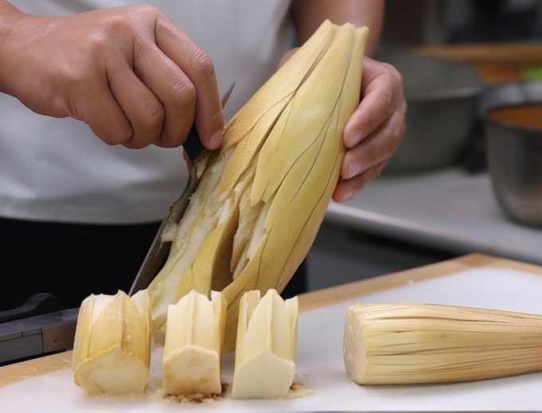

作者：何一涛

日期：2023 年 8 月 20 日

涛然自得周刊主要精选作者每周阅读的书影音内容，不定期发布。历史周刊内容可以看[这里](https://github.com/imhet/beyond-code-weekly)。

## 电影

[《沼泽深处的女孩》](https://movie.douban.com/subject/35230876/) 改编自小说[《蝲蛄吟唱的地方》](https://book.douban.com/subject/34813209/)，主角是一位在沼泽地独自生活并长大的女孩，她从小被附近小镇居民歧视，被戏称为”沼泽女孩“。在情窦初开的年纪，两名小镇青年陆续闯入了她的世界，她敞开了自己的心扉，但爱情的伤害接踵而至，一件突如其来的谜案更让她陷入了失去自由的危险境地。

平心而论，电影中选的主角很符合书本形象的，剧情也与书中差不多。但小说本身比电影精彩很多，作者迪莉娅·欧文斯是一位生物学家，小说以她研究的湿地环境和自己的生活经历为基础写成，这是一个成长故事，也是爱情故事，还是一个悬疑故事，它会让你想一口气读完，同时会有一种代入感，你会了解主角被遗弃时的那种孤独，了解她如何从大自然的动植物中学会了独自生存的技能，了解到她创作绘画和诗歌源自对孤独的排解和对大自然的报恩。

蝲蛄吟唱的地方到底是什么？小时候，作者的母亲经常鼓励她去徒步或者骑马，尽她们所能深入橡树林去冒险。母亲希望她体验真实的自然，找到鹿和狐狸仍然充满野性的所在。母亲会说：“到蝲蛄唱歌的地方去吧。”后来作者从书上了解到，蝲蛄并不真的会唱歌，但如果你在荒野中走得够远，你会听到它们的歌声。母亲是对的：我们需要走到那里，走到蝲蛄吟唱的地方。在那里，我们的秘密藏在萤火虫不诚实的信号中。

## 文章

1. [成为自己](https://mp.weixin.qq.com/s/qjvks8jEZRvb_MvyzgIVyQ)

成为自己，就是一次又一次地划清边界并剥离出非我的过程。只有持续剥离，持续精简，才能成为更好的自己。

2. [想躺平，不想努力，可以吗？](https://mp.weixin.qq.com/s/f4OVLeFafFPKVJ2NSBcwuA)

对一个有追求的人来说，躺平是不可能躺平的。躺平实质上指的是抛开那些无聊的日常琐事，以便节省出更多的时间，去做真正感兴趣的事情。

3. [深入探讨：MBTI究竟有用吗？](https://mp.weixin.qq.com/s/kVb8Dw8fpL4Cb-BvYFlnBw)

MBTI 存在一些致命缺陷：将人格分为16种类型被心理学界反对，信度和效度都比较差，缺乏科学基础，结果不可信。

MBTI 的价值在于帮助我们了解自己想要的方向，通过给自己贴上对应的标签，让彼此更高效地沟通交流，节省时间和精力。

MBTI 可以作为娱乐、了解自己的方式，或是沟通交流的工具，但不能过度依赖它的结果。

4. [中产，一个阶层的自我修炼](https://mp.weixin.qq.com/s/yupL0tuPZa4Ln7FsA_WEig)

中产阶级并不快乐，大部分人仍想往上爬，换句话说，中产阶级很难感受到自己已经获得的成就。对不如自己的人，视而不见。对自己不如的人，念念不忘。

中产阶级需要注意避免高风险投资和生活中的各种意外。降低对子女教育和养老的预期，也是必要的。

中产阶级应该放弃比较，尽量用自己的内在记分牌，替换掉别人或者社会硬塞给我们的参考系。

5. [干货 | AI大模型的8条“反共识”和“冷思考”](https://mp.weixin.qq.com/s/LZBj_rYUk6nyoL4go4zRxQ)

大模型不是越大越好，未来将是混合模型，中小模型因数据少能产生差异性，对于大模型，场景应用深挖变得至关重要。

人工智能的真正价值在于它可以不眠不休、7×24小时、同时和千万人进行交互，成为人类的助手而非对手。

## 书摘

1. 在那几个星期里，乔治·腓特烈·亨德尔已经没有了时间的概念，没有白天和黑夜。他完全生活在一个只用旋律和节拍来计量时间的环境中，他的身心已完全沉浸荡漾在内心深处所涌出来的奔腾激流之中，那神圣的激流愈湍急，愈奔放，作品也就愈接近了尾声。他被囚禁在自己的心灵之中，只是伴随节奏踩着步伐，走遍这间自设的牢狱似的房间。他一会儿唱着，一会儿弹起羽管键琴，然后又重新坐下来不停地写着，直至手指发疼，他在有生之年还从没有爆发出如此旺盛的创作欲，也从未经历过如此殚精竭虑的音乐生涯。--- 《人类群星闪耀时》

2. 我所理解的生活就是做着自己喜欢的事情，养活自己，养活家人。生活不是攀爬高山，也不是深潜海沟，它只是在一张标配的床上睡出你的身形。我也不觉得留有遗憾是一种缺憾美，相比之下，干砸了倒是一种美。我喜欢的事情远不止写作和赛车，我还做很多事，有些做得不够好，有些做得很失败。---《我所理解的生活》

3. 这位思想者缓缓地走自己的路并向自己道：“你想要从教义和教师那里学到，而尽管他们教给你许多，却无法传授与你的那件事到底是什么呢？”他接着想：“那就是自我，我希望学到有关自我的意义与本质。过去我一直想要摆脱自我并征服自我，然而我从未能够征服自我，我只是在欺骗它，逃离它，躲避它。的确，世上没有任何东西能够如自我那样占据我全部的思绪。这是一个难解之谜：我存在，而且我是惟一的不同于任何其他人的独立个体。我是悉达多。我对世上万有所知最少的恰恰是我的自我，恰恰是悉达多。” ---《悉达多》

4. 海明威一生中出版了15本书，我将他最喜欢的提高效率的方法也用在了自己身上，包括在写这本书的时候。每次写作，海明威都会在一个句子的中间就停笔，而不是把一个章节或段落写完。这种不完整的感觉点燃了中间点火花，成为他第二天写作的直接动力。这个方法有效的一个原因就是所谓的蔡加尼克效应（Zeigarnik effect），即我们更倾向于记住那些未完成的任务。24当你处于项目的中间点时，试着用一个未完成的任务来结束一天，但要明确下一步，这也许能助燃你的日常动力。 ---《时机管理》

5. 停止思考我们自己的成就和需要，让我们去研究别人的优点，把对人的恭维、谄媚忘掉，给予人由哀、诚恳的赞赏。人们对你所讲的，将会重视和珍惜，终生藏之背诵……即使你已把这件事忘了很久；可是他还牢牢记着你所说的话。献出你真实，诚恳的赞赏。 --- 《人性的弱点》

