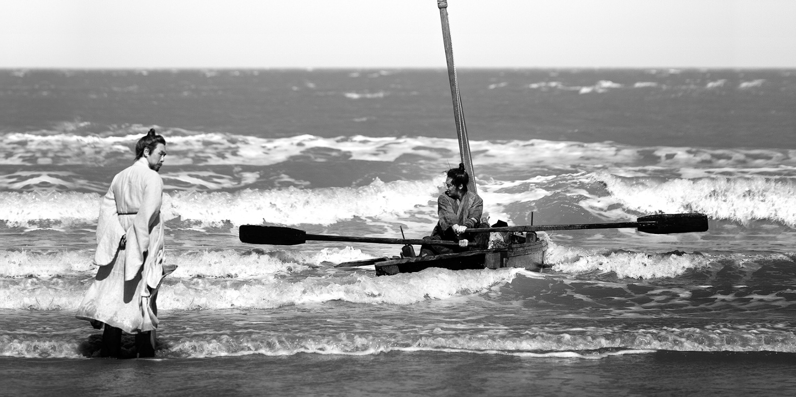
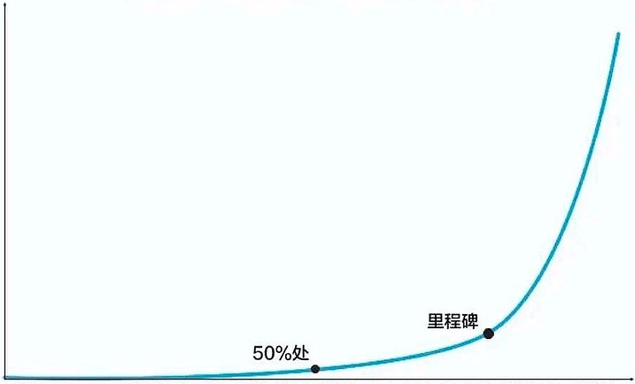
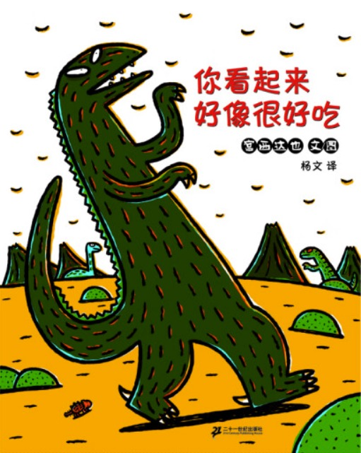

作者：何一涛 

日期：2023 年 8 月 27 日

涛然自得周刊主要精选作者阅读过的书影音内容，不定期发布。历史周刊内容可以看[这里](https://github.com/imhet/beyond-code-weekly)。

## 电影

[兹山鱼谱](https://movie.douban.com/subject/30409439/) 讲述丁若铨因政治事件被贬黜到了遥远的黑山岛。来到岛上后，丁被大自然环境疗愈，开始对岛上的海洋生物产生了浓厚的兴趣，想着自己仕途无望，决定写一本关于海洋生物的书籍。于是他认识了岛上的土生土长的年轻渔夫昌大，一来二去，丁教昌读书，昌教丁认识岛上海洋生物，两人亦师亦友。随着昌大读书慢慢有长进，他决定参加走仕途道路，这与丁的想法相悖，两人分道扬镳......

丁被流放到黑山岛让我想起了苏东坡。才学兼具的苏东坡被一次次的贬黜放逐，后来慢慢地想开了，开始关心饮食和生活，于是有了东坡肉，有了名传千古三咏赤壁赋，有了何妨吟啸且徐行的豁达。苏东坡通过饮食和文笔实现了对现实困境的突围，电影中的丁通过编写海洋生物书籍完成了对黑山岛禁锢的突围。

达则兼济天下，穷则独善其身。儒家士大夫在出世的心态在这部韩国电影中表达得很清晰，我不禁感慨，这类电影为什么国内没有拍？也许是审查原因，也许是导演们都太关注商业电影而不关注这类偏文艺的电影吧。

## 文章

1.[一个也许最常见的学习误区](https://mp.weixin.qq.com/s/iRUjHwJmdeKVvrE0i66-Tw)

我们习惯于为新的概念、方法和技巧所俘获，成为文章收藏家。但概念本身只是表述真实世界的一个个山峰，并不代表整个真实世界。这些概念是别人灌输给我们的，不能一味的接受，我们应该思考概念背后的原理，它的本质是什么，它的作用是什么。再把它与我们的需求结合起来，去应用解决问题。这样把本质参透为我所用的方法才是最适合我们的学习方法。

2.[对贡献有激情，对回报有信心](https://mp.weixin.qq.com/s/hyNedsnZX-f55Hn_K13XWw)

我们做一件事往往是因为相信它值得做，长期有价值，但短期内并不一定会有回报。只有不断把做事的质量提升，持续打磨，坚持进行，才可能量变引起质变。短期过于追求回报，往往是量上积累不够，达不到引起质变的阈值。

这点在写作上很明显，身边有朋友写了 300 多篇公众号文章，大部分阅读人数都不足 30 ，直到有一天他的某篇文章无意中命中了某个热点，一下子 1w 多阅读，涨粉很多，同时其它的文章的阅读量也有明显的上升，从此开启了正循环。我想着的是他写了 300 多篇文章，首先很多都是为自己而写的，并没有太关注阅读数，只顾着自己输出总结思路，否则也坚持不了那么久；其次，这么多篇文章聚集在某几个小领域，成了某个小领域重要的一部分，现在的推荐那么智能，文章很容易就找到自己的目标用户。

3.[宫西达也 霸王龙和红果子的秘密](https://mp.weixin.qq.com/s/CgjWbmtv3oPTAg-OZKeXtQ)

不是只有成为政府官员，或进入一流的公司才是厉害，我们可以在更多的事物上竞争，有人擅长艺术，有人很会跑步，有人喜欢画画，拥有各种各样的人不是很好吗？不然的话，考试失败的人，就真的像个失败者了，太可怜了。我想说，无论如何，孩子们并没有输啊。

我创作绘本最重要的核心是，我想写什么，我想在绘本中表达什么，我想要通过绘本向大家传递什么。

4.[用钱换时间？别忽略这些因素](https://rtw1bnq45a.feishu.cn/docs/doccnqWYT7wAGJPJzuI3y4lDBXc)

外包有时候很好，但它比看起来更昂贵。有时候，最好是自己动手，并在过程中学习有用的技能。这可能会让你的自尊心得到提升，也会对高质量的工作有更高的赞许。

5.[对话王强：我只有一个世界，而且它相当和谐](https://mp.weixin.qq.com/s/Od9kir0w2_R95Sse_pATmw)

康德哲学的三个问题：第一个世界是什么；第二个人应该做什么，第三人还希望什么。“你们年轻人难道不应该时时刻刻问自己这些问题吗？“他问。

我觉得人生也是这样，你必须找到能够让你冷静、理性、淡定的东西，你的 “减速玻璃”。它是什么，只有你自己的思考和寻找才会发现。

## 书摘

1.我们的主观判断有两大倾向：一个是“贪”，希望把好的东西占为己有；另一个是“嗔”，希望远离不好的东西。因为“贪”和“嗔”，我们无法客观看待世间万物，这就形成了“痴”。佛学提供的一个方法是冥想。冥想的直接作用是训练跟各种感觉的剥离。我们在冥想中要观察随时产生的各种感觉，而不被感觉所劫持，不做感觉的奴隶。这样我们就能超越贪、嗔、痴，看到更客观、更真实的世界，体会到世界的美好。 ---《洞见》

2.说到底，我们至少身处两种幻觉中。一种是关乎“意识自我”的本质，我们以为自己对事物的掌控力比实际情况要强。另一种幻觉关乎我们到底是怎样的人，即我们的能力和品德。你可以将这两种错觉称作“关于自我的幻觉”。二者是协同作用的。第一种幻觉帮助我们说服世界认同我们是统一、始终如一的行为者：我们不会毫无来由地做一件事，而且我们做一件事的理由是讲得通的；如果我们的行为应该得到赞扬或遭受责备，那么得到这些评价的应该是一个内在的我。第二种幻觉帮助我们说服世界认同我们应该得到赞扬，不应遭受责备；我们的道德水平比一般人的更高，效率也比一般团队成员更强——我们有“益效”。---《洞见》

3.工匠思维对待职业生涯的一种方式；是以产出为中心的职业观，关注自己给世界（工作）带来的价值。这种思维对于打造自己所热爱的事业至关重要。激情思维对待职业生涯的另一种方式；关注世界（工作）给自己带来的价值。这种思维模式与工匠思维相对立。激情思维最终会导致长期的不满，并让人不切实际地幻想还有更好的工作。工匠思维关注自己能给世界带来什么，而激情思维则关注世界能给自己带来什么。大多数人是用后一种思维方式来对待自己的职业生涯。 ---《优秀到不能被忽视》

4.人到了怎么样的境界可以称为真正的成年？我认为大概有两个标志：第一是明白自己，对自己的过往有真正的理解；第二是反思自己，能看透自己存在的问题。一个人成年的决定性标志就是开始自觉的自我反思：你不只是在过自己的生活，而且能够有意识地反观自省你的生活。这有些像是孔子说的“四十不惑”。 ---《刘擎西方现代思想讲义》

5.漫天神灵，就意味着到处是人类问题的解决方案。渔船出海，祭奠一下妈祖；打仗出征，到神庙去占卜一下；生不出孩子，去求送子观音。虽然未必有用，但至少有路可走，心里是安稳的。这些冥冥之中难以言说的神秘事物，组成了古代精神极为重要的一部分，让人类与整个宇宙紧密相连为一个整体，构成宇宙秩序。古代人从这种整体秩序中确立了生存的意义，获得所谓“安身立命”的根据。在这个意义上，古代的人类是“嵌入”在整体宇宙之中的。---《刘擎西方现代思想讲义》

