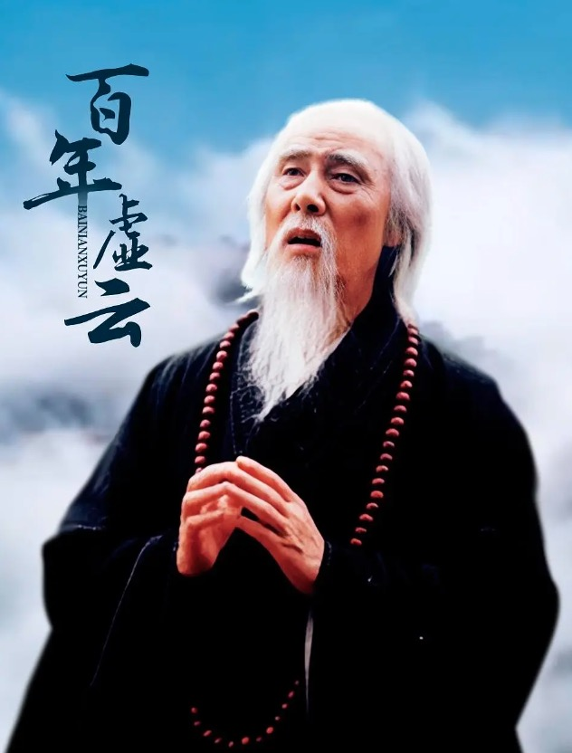
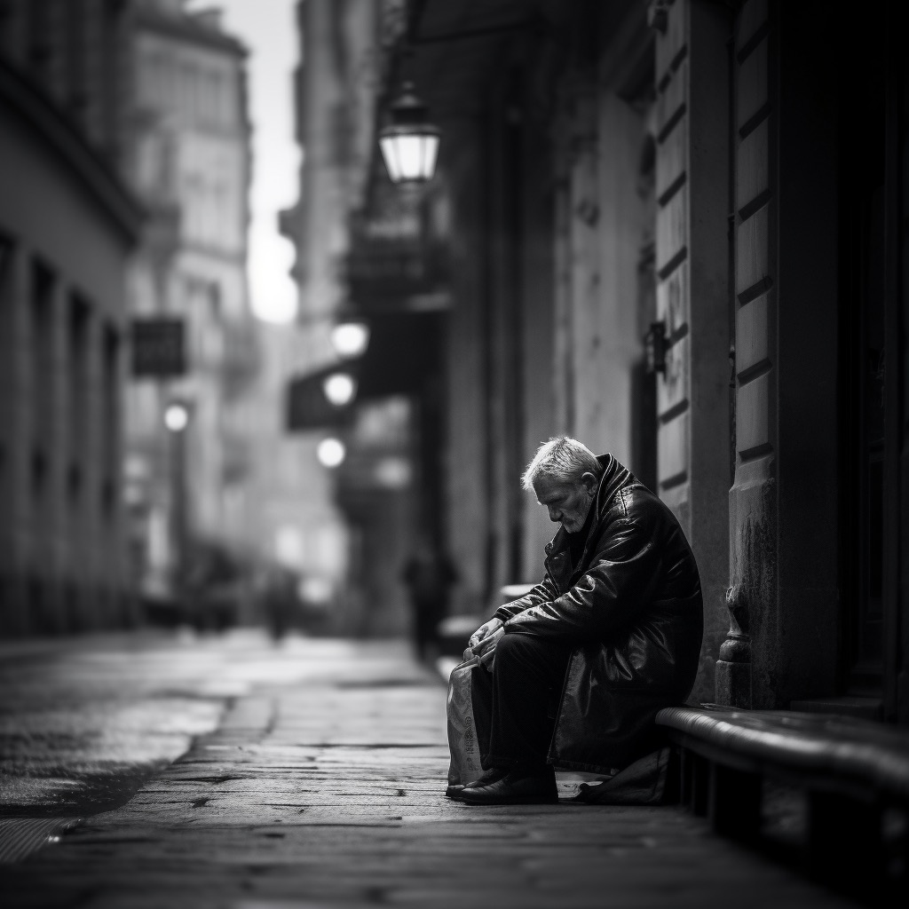
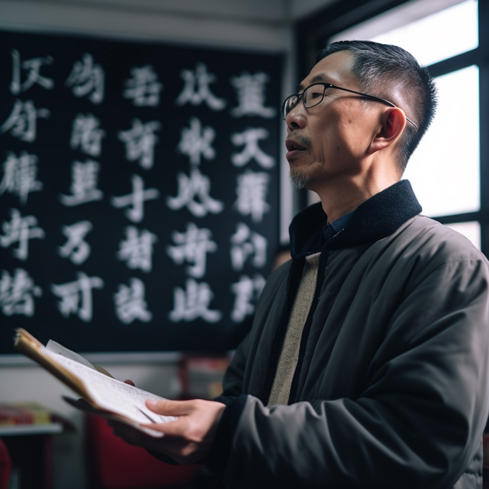

作者：何一涛 

日期：2023 年 9 月 2 日

涛然自得周刊主要精选作者阅读过的书影音内容，不定期发布。历史周刊内容可以看[这里](https://github.com/imhet/beyond-code-weekly)。

## 电影

[《百年虚云》](https://movie.douban.com/subject/4228538/)是一部 20 集的电视剧，讲述近代四大高僧之首虚云法师的一生。虚云法师生于 1840 年，于 1960 年圆寂，活了 120 岁。虚云法师出家前的名字是萧古岩，他出生后母亲就去世了，受奶奶影响，他从小对佛学就感兴趣，作为福州知府的父亲希望他存续香火，给他娶了两位大家闺秀。他少年立志出家，始终未能与两位妻子同房。在结婚两年后，他逃离家庭，去涌泉寺剃度出家出家，为了避免被父亲找到，他去了寺庙附近一个岩洞里修行了 6 年，整日参禅打坐，吃野菜，与野兽同行，练就了矫健的身手。之后被一位高僧点化，从岩洞走出来在天台山修行。他 40 多岁时，想着一辈子亏欠父母太多，于是开始了从普陀山到五台山行愿，三千多里路，三步一拜，走了三年多终于到达目的地。之后他走遍各地寺庙，足迹涉及西藏、尼泊尔、印度、泰国等地。八国联军侵华时，他随慈禧西行，一路救人无数。之后重整迦叶尊者道场鸡足山，消弭汉藏硝烟，修复南华禅寺等 60 多个寺庙，渡人无数，直到 120 岁圆寂。

虚云法师少年时就知道自己的志向，后来抛弃荣华富贵和两位妻子毅然剃度，开始我不是很理解，为什么不先续香火然后再出家呢？这样既满足了家庭的要求，也可以达成自己的目标。后来从他修行艰难过程中发现，如果先续了香火，有了羁绊，后面的修行估计是坚持不下去的。没法做到真正的放下，又如何去证道去渡众生呢？从他的行为上看，有点效仿佛陀出家的过程。

《百年虚云》由深圳弘法寺出品，制作上跟现代精品剧肯定没得比，为了过审也隐去了不少真实的剧情，但讲佛教人物的电视剧不多，剧情上还算还原史实，推荐观看。另，深圳弘法寺祖师本焕大和尚是虚云的弟子，这可能是这部剧由弘法寺出品的原因。部分剧集上出现的念经的声音就是弘法寺的和尚念的，感兴趣的朋友可以留意下。

附一首虚云法师百岁时做的诗：少小离尘别故乡，天涯云水路茫茫。 百年岁月垂垂老，几度沧桑得得忘。 但教群迷登觉岸，敢辞微命入炉汤。 众生无尽愿无尽，水月光中又一场。

## 文章

1.[拒绝新闻的生活](https://mp.weixin.qq.com/s/93E4DW8kusdY8pVZyGZQTw)

曾几何时，一杯茶一份报纸是多么悠闲的生活方式，那时候，信息匮乏，多数媒体还算有些操守。如今，劣币驱逐良币，博人眼球的假资讯爆炸，没什么意义的短视频满天飞，垃圾信息攫取了大家稀缺的注意力。就像吃东西一样，饥不择食，什么垃圾都进去，肚子会痛，最后还得拉出来。而今天的大多数新闻已经成了垃圾信息，除了耗费生命别无用处。拒绝新闻，读深度好文，读经典好书，吃点好的，不贪多，很有必要。

2.[2023年，会不会是很艰难困苦的一年？](https://mp.weixin.qq.com/s/FBSL9-sABuO1Tm4NyfEg2w)

经济周期的根本原因是人们将短期成功经验无限外推，造成巨大的资产错配，导致所有人的生意困难。要判断乱纪元何时过去，就得看这场史诗级的资源错配何时能消化掉。新的科学技术的突破早点来，才会真正产生新的财富周期。

3.[别让金句毁了你的独立思考力](https://mp.weixin.qq.com/s/Z8JKOi62ttrBjwWvhMFk0A)

金句省略了中间推导过程，全盘接收容易毁掉独立思考能力。可以从正反两方面进行思考，正面思考金句为什么是正确的，反推它的推导过程。反面思考是找出金句的例外，或者对金句涉及的概念进行澄清来思考。

4.[我们到底需要什么样的语文老师？](https://mp.weixin.qq.com/s/kWQD8kIAi9lx1fED6rjGTw)

好的语文教育究竟能带给一个人什么？毕业多年后，他的学生们给出了回答：那是独立的人格、丰沛的精神生活、无功利的阅读习惯，和遵从内心的勇气。

高中时代有幸遇到过一位语文老师，他自费打印了很多好的诗词给我们分享阅读，教我们感受古文的美好。哪些古诗词现在时不时还会在各种场景里想起，想起的还有老师当年意气风发朗诵的样子。

5.[王川: 一年读五百本书，让你每天高潮迭起](https://chuan.us/archives/166)

这篇文章纠正了我一个不好的读书方式：硬读。硬读死磕是学生时代养成的读书方式，所谓书读百遍其义自见，但很多书不值得读那么多遍，难读就是难读，难读并不代表书内容好。拣感兴趣的读，不感兴趣跳过绕开，如果真是好书等知识储备够了再读，不要浪费太多时间爬一座难登的山，多去爬爬其它的山，积累经验，形成一览无余的山顶视角更重要。

## 书摘

1.我们眼中的穷人世界，常常是一片失去机遇的土地。我们会好奇，为什么他们不把买那些东西的钱攒下来，将钱投入到真正能使他们过得更好的地方？然而，穷人会更加怀疑那些想象中的机遇，怀疑其生活产生任何根本改变的可能性。他们的行为常常反映出这样一种想法，即任何值得做出的改变都要花很长时间。这也可以解释，为什么他们只关注当前，尽可能把日子过得愉快，在必要的场合参加庆祝活动。---《贫穷的本质》

2.我们的真正优势在于，很多东西是我们在不知不觉中得到的。我们住在有自来水的房子里，不用想着每天早晨往水里加氯。下水道自行运转，我们甚至不知道是怎样运转的。我们大都相信医生会尽力为我们服务，公立医院会告诉我们该做什么，不该做什么。我们别无选择，只能让孩子接种疫苗（公立学校不接收未接种疫苗的孩子）。即使我们出于某种原因没给孩子接种疫苗，他们可能也会安全无恙，因为其他所有人都接种过了。如果我们去健身房，我们的保险公司会奖励我们，因为他们担心没有奖励我们会不去。而且，或许最重要的是，我们大多数人都无须担心是否有下一顿饭吃。换句话说，我们几乎用不着自己有限的自控及决断能力，而穷人则需要不断运用这种能力。---《贫穷的本质》

3.很多人都会遇到更有经验的对手，也许我根本没有可能赢。但是，如果我迈出脚步，鼓起勇气，最后累晕，对手仍然打败了我，只要我让对手紧张起来，让他竭尽全力才能赢我，那么这只证明当天他的表现比我好。 ---《鞋狗》

4.他随后打算把店铺打造为所有跑者都心向往之的圣地。他购买可以找到的和买得起的（来自庭院旧货拍卖）最舒服的椅子，为跑者打造适合闲逛和交流的最美空间，书架上摆满每个跑者都可以阅读的图书，其中不少都是他自己珍藏的初版图书，墙上都是各种脚穿鬼冢虎的运动员照片。他还贮存了一批T恤，胸前丝网印制了鬼冢虎标志，这些都是为最好的客户准备的。此外，他把鬼冢虎鞋子展示在黑色涂漆墙面上，以灯光照射展示，这相当时髦、标新立异。全球没有一个地方有过这样一个专为跑者打造的庇护所，一个不仅出售跑鞋，还颂扬跑者和跑鞋的地方。约翰逊，受跑者们敬仰、志向远大的领袖，终于创建了自己的“教堂”。---《鞋狗》

5.鞋狗就是那些全身心投入其中，努力制造、销售、购买或设计鞋子的人。一辈子从事这个行业的人会乐于使用这个词来描述其他终生致力于此的人，他们不论男女都劳心劳力地为鞋子这一事业奋斗，完全不考虑其他事情。这是一种耗费时间和精力的狂热，一种可以分辨的心理紊乱，他们太过关注内底和外底、线条和贴边、铆钉和鞋面。但我理解这种情绪，普通人一天平均要走7500步，一生要走2.74亿步，相当于绕着地球走6圈。于我而言，鞋狗只是想要参与大家的这趟旅程，鞋子是他们与人类联系的方式。在鞋狗的观念中，改进每个人与地球表面接触的方式就是优化这种联系方式。---《鞋狗》

