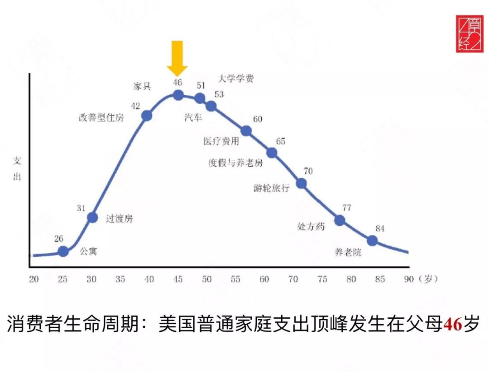

作者：何一涛 

日期：2023 年 9 月 9 日

涛然自得周刊主要精选作者阅读过的书影音内容，不定期发布。历史周刊内容可以看[这里](https://www.heyitao.com/weekly)。

## 影音

本期要推荐的是台剧[我们与恶的距离](https://movie.douban.com/subject/30181230/)，豆瓣 44w 人评分 9.4 ，由贾静雯主演，讲述一场无差别杀人事件之后相关人如何走出阴影的故事。

儿子被无故杀害，母亲把过错归结在自己身上，家庭因此濒临破碎，他们如何从阴影中走出来？

儿子杀人后被执行死刑，一家人除了不断地道歉，不断地逃避人群，还能做些什么，他们应该毕生都为子偿债么？

作为法律扶助律师，因为参与了帮死刑犯辩护，备受他人谴责，他的家人如何看待他，他会后悔为死刑犯辩护么？

......

这是一个可能发生在我们每个人身边的故事，当事件发生，我们会选择如何面对？

## 文章

1、[驯服你内心的猛玛巨兽：停止在意别人的想法！](https://mp.weixin.qq.com/s/i6VawA4hC-5cKrr4uXGtvg)

我们渴望被社会接受、受人敬佩，怕被人讨厌。这是远古时期我们的祖先为了在部落生存形成的执念，这就是社会认同，它就像一头古老的猛犸象一样占据了我们的头脑。但我们的文明进化太快了，生理进化远远跟不上，猛犸大象在很多方面都落伍了。

猛犸大象会让你觉得一个人去餐厅吃饭或看电影是ㄧ件很诡异的事，它让你放弃了你有热情的工作去选择一个你一点都不在乎但薪水比较高的职业，它让你为了赢得某个在你生命中占有重要地位的「偶像」的肯定而忙碌......

这些是你为了满足猛犸象而做的事，「真正的你」一直被压抑。你很容易就失去自己，成为社会运转过程中的一个齿轮。

执着于得到社会认同没有意义，从空间上看，我们只是浩瀚宇宙的一粒微不足道的星辰，从时间上看，我们的人生也不过是时间长河上的一瞬间。

你需要从他人的评价中进行反省找出真正的自己，找到你最大的恐惧，找到别人认同你时你感到满足的事情，找到哪些没有别人认可你就会不自在的决定......

「真正的你」都是独一无二而且难以定义的，猛犸象只是在做别人认为它应该做的事。

你才是主导者，猛犸象永远应该是跟随者。

2、[投资中的信号与噪声](https://mp.weixin.qq.com/s/Ypig4_Izpo0W6tUdAjc8zg)

投资中充斥着大量无意义的噪声，这些噪声淹没了真正的信号，对投资造成了干扰。

经济活动可以看做是很多不同周期函数叠加的结果，投资者需要从中找出最大的信号，这个信号就是人口结构的变化。

3、[投资决策中的信噪比](https://mp.weixin.qq.com/s/GdVjomlxKdXIDGSYrcY6gA)

信噪比是信息中信号与噪声的比例，信噪比越大说明信号的比例越高、信息质量越好。

在投资中如何筛选信号，提高信噪比？可以学习人类处理视觉信息的「注意力机制」。

简单来说，就是预先归纳事物的特征，当需要决策时，我们通过这些特征再进行比较，提高决策的效率。

「注意力机制」对我们日常活动也有启发，通过认识自己，思考事物的本质，从庞杂的信息中找到自己真正在乎的什么。

4、[我们就这样，散落在「天涯」](https://mp.weixin.qq.com/s/qY3PrfYrzsRweYD_MC2fTQ)

稍微接触过早年互联网的人都知道「天涯社区」，当年这个网站红极一时，是中国互联网的顶流。随着移动互联网的发展，天涯社区逐渐离开了主流互联网的视野，直到 2023 年 6 月左右天涯为了维持正常运营在抖音直播间筹款的事，之后就一直无法访问。

我接触天涯是在大学期间，那时没事就泡在里面，看各种感兴趣的精华帖，那些帖子扩展了我的视野。后来为了方便阅读，我用 java 写代码抓取过其中的一些精华帖，实现了脱水贴、只看楼主等功能。印象中不再看天涯是在 2011 年左右，那会微博、知乎开始流行，各大新闻网站也在发力开发 APP ，记得比较清楚的有网易新闻、腾讯新闻、zaker 等等，这些网站和 APP 都比天涯使用起来更方便，内容也更好。

这篇文章主要从天涯社区第一位员工小黑的视角讲述「重启天涯」的整个过程，悲剧的是这个计划失败了，天涯没能重启，曾经散发着自由气息的天涯再也没有了，互联网上存活的是各种监管严格的APP。至于天涯社区发生了什么？为什么天涯没有跟上移动互联网浪潮？可以结合[对话天涯创始人邢明：天涯重启之后，未来何去何从？](https://www.xiaoyuzhoufm.com/episode/647a15f01672628240bfbd7e)这一期播客节目来了解，你会发现，“困在时间里的老邢”也许就是天涯没落的最大原因。

5、[好问题的价值](https://mp.weixin.qq.com/s/VxcRNuUm3cOS2NajW6zEhA)

一个好问题能提供新的思维视角，在人生要事上，提出好问题，深入探索下去，思考也会变深。

## 书摘

1、中国文明从根上就是农业文明、定居文明。定居文明中，人们的生活方式不过是对上一代的重复，老年人的经验和智慧是至关重要的，因为他们知道什么时候发洪水，什么时候播种。所以我们说：“不听老人言，吃亏在眼前。”在农业社会，老年人是永远的权威，一切社会资源都掌握在老年人手里，老年人对家族的支配是终身制的，年龄越大，辈分越高，发言权就越大。所以中国社会是一个“尚老社会”。

---[《简读中国史》](https://book.douban.com/subject/34501169/)

2、我意识到：如果没人记下一些事情，妈妈在这个世界上的痕迹将迅速被抹去。在不算遥远的那一天，我自己在这世界上的痕迹也将被抹去，就像一层薄薄的灰尘被岁月吹散。我真的来过这个世界吗？经历过的那些艰辛困苦什么都不算吗？ 

---[《秋园》](https://book.douban.com/subject/34998019/)

3、人的内在空虚就是无聊的真正根源，内心空虚之人无时无刻不在寻求外在刺激，试图借助某事某物使他们的精神和情绪活动起来。他们做出的选择真可谓饥不择食，要找到这方面的证明，只须看一看，这些人所沉迷的消遣是多么的贫乏和单调，还有同一样性质的社交谈话，以及许许多多靠门站着的和从窗口往外张望的人。正是由于内在的空虚，他们才追求五花八门的社交、娱乐和奢侈；而这些东西把许多人引入穷奢极欲，然后以痛苦告终。

 ---[《人生的智慧》](https://book.douban.com/subject/3261600/)

4、我们存在的基础，因此亦即我们幸福的基础，是我们的动物本性。因此，健康对于我们的舒适是最重要的，其次就是维持生存的手段，亦即不带操劳的收入。荣誉、地位、名声——尽管这些被很多人视为价值非凡——却不能够和关键性的好处相提并论，或者取代它们；在必要的时候，为了前两项的好处，我们应该不容置疑地放弃这第三项好处。 

---《人生的智慧》

5、占星术提供了一个极好的证明，说明人的这种可鄙的一切围绕着自己的自我、一切从自我出发的特性。因为这种一切从自我出发，人们把每样事物都跟自己扯上关系，从每种思想见解都径直联想到自己。占星术就是把天体的运行与人的悲惨自我拉上关系，并且把天空中星体与尘世间的俗事、丑行联系在一起。 

---《人生的智慧》

<完>