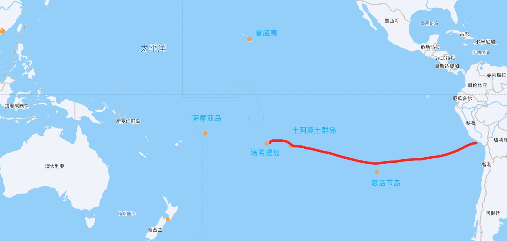
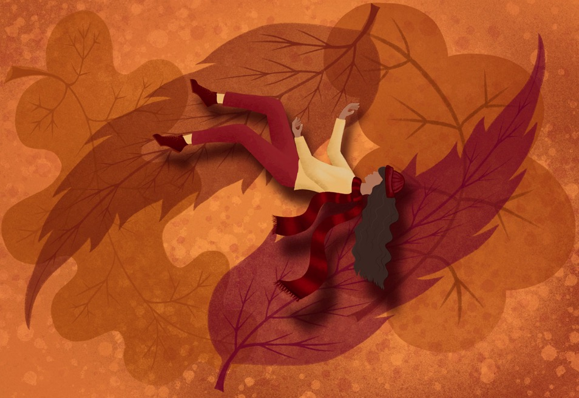
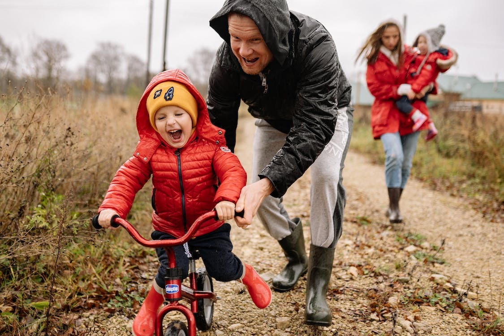
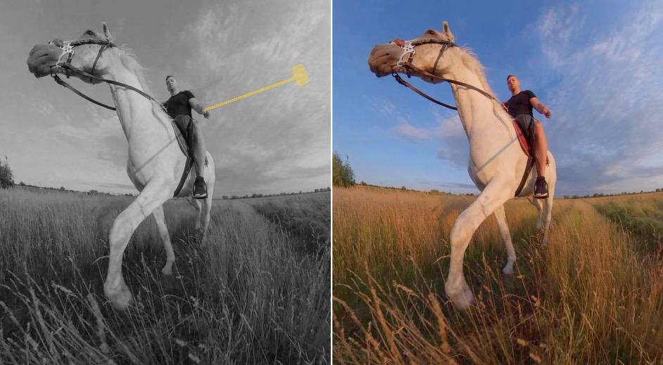

作者：何一涛 

日期：2023 年 9 月 17 日

涛然自得周刊主要精选作者阅读过的书影音内容，周末发布。历史周刊内容可以看[这里](https://www.heyitao.com/weekly)。

## 影音

[孤筏重洋](https://movie.douban.com/subject/5155128/)是同名[书籍](https://book.douban.com/subject/35006761/)改编的电影，讲述挪威著名探险家和人类学家索尔·海尔达尔的真实经历，他在1947年与五位朋友乘坐木筏从秘鲁出发，顺着洋流漂流，穿越太平洋，成就一段传奇的冒险经历。

索尔做木筏穿越大西洋的原因是他花了 10 年时间写了一本书，书中提出理论「波利尼西亚原住民是来自南美洲，而不是亚洲。1500年前，提基和他的信徒乘坐木筏在风向和洋流的作用下，穿越大西洋5000英里，从秘鲁漂到波利尼西亚」，但遭到社会科学理论界的质疑和否定。为了证明自己的理论，1947年4月28日，他和5个朋友亲自乘坐木筏（康提基号，Kon-Tiki，波利尼西亚人的祖先），从南美的秘鲁出发，耗时101天，平安到达波利尼西亚拉罗亚。托尔在航行中，用摄像机拍下的记录片获得1952年奥斯卡最佳影片“金像奖”。

索尔的漂流路线大致如下，但整个过程中历经磨难。四处凑集资金，招募合适的旅行伙伴，根据书中和一些口头信息打造出与古波利尼西亚人类似的木筏，在秘鲁总统的帮助下筹备了物资，开始了孤独的漂流，接着遭遇海上风暴，鲨鱼追袭，队员晕船，无线电连接不上信号，船员落水等等，最终冒着被巨浪拍在暗礁上的风险登陆了波利尼西亚的一个岛屿。

书和电影给我最大的收获是索尔他们的冒险精神，不畏惧权威的挑战，敢于用实际行动证明自己，挑战自己。这种精神无论是放在 1947 年索得差不多了已经失去了神秘性的环境，还是目前低迷的经济形势环境中，都能对他人有着巨大的鼓舞作用。其次的收获是书中描写的很多海洋生物满足了我的好奇心，遭遇世界上最大的鱼--鲸鲨，目睹海龟与海豚搏斗，经常可见的成群结队嬉戏的鲸鱼，一路随行的海豚，还有飞鱼、向导鱼、蛇鲭、鲨鱼以及千奇百怪的海洋浮游生物......

## 文章

1、[中年不是崩溃，而是瓦解](https://pmthinking.com/database/%E7%B2%BE%E9%80%89%E9%9B%86/%E4%B8%AD%E5%B9%B4%E4%B8%8D%E6%98%AF%E5%B4%A9%E6%BA%83%E8%80%8C%E6%98%AF%E7%93%A6%E8%A7%A3)

中年不是一场危机，而是会持续很长时间的逐渐瓦解。这个过程中我们需要撕掉在人生前半段被贴上去的标签，在一次又一次对抗过程中慢慢接收真实的自己，获得新生。

原文是休斯顿教授 Brené Brown 写的 [The Midlife Unraveling](https://brenebrown.com/articles/2018/05/24/the-midlife-unraveling/)，可以对照着原文一起看。

2、[我们为什么会越来越累？](https://mp.weixin.qq.com/s/mMEUts8wCWAz44fl2qsHow)

当下社会充满积极的口号，它看似自由，却让人们在过度的积极性中自我剥削，直至精疲力尽，感到疲累和抑郁。一个人在生活或者工作中获得的反馈不足以抵消内心的消耗，心理收支不平衡，就容易导致倦怠。

倦怠会让人逃向享乐主义，不愿意去做努力工作、婚姻、生育这类增加倦怠感的事，倦怠改变了人对未来的预期。

要摆脱倦怠，需要及时进行自我充值。一定不要勉强自己去做超负荷的事情，尤其是不能让这种超负荷成为一种长期的状态。多做能带来心理活力的事，少做带来焦虑和损耗的事。维持好亲密关系，多与朋友和基于兴趣的社群的人交流。少刷手机多生活，减少无意义信息的干扰。

3、[[译] Paul Graham: Life is Short](https://mp.weixin.qq.com/s/M3U9hI_0SVPVA6vjoAcyEA)

生命短暂，赶紧去做重要的事情，尽可能少做不必要的事。

4、[「不得不」是个可怕的幻觉](https://mp.weixin.qq.com/s/pPkdSlEvgnrPAEPfNd0dWg)

当你「不得不」做某些事时，你也许是在合理化内心深处觉得不正确的事。

5、[影石Insta360刘靖康：当机会稀缺，年轻的后来者如何做到第一？](https://mp.weixin.qq.com/s/1-BhCwUO1mIxL5j5ZAoqnA)

刘靖康想到一个点子，把影石的全景相机绑到老鹰上，记录鹰飞翔时看到的风景，每年都会飞一次。当换一个视角和方式看世界，看似无路之处，也会有前进的方式。

影石的成功一方面是选择了合适的赛道，另一方面是擅于借鉴行业内外的成功经验。虽然在招聘和对待员工方面口碑不行，但不得不说影石还是有些创新的。比如“隐形自拍杆” 功能可在拍出的视频里自动隐去自拍杆，仿佛有第三人在跟拍。

## 书摘

1、在公司内部，人们为了升职，时刻关注对手动态。而公司为获得市场也留意着竞争者。在所有人类冲突的戏码中，人们往往忽视了真正重要的事情，只把精力放在竞争对手身上。

---[《从 0 到 1》](https://book.douban.com/subject/26297606/)

2、在工作中，我见过被重重压力团团围住而喘不过气来的人，这样的人世界各地都有。我指导过的人中不乏“成功”人士，但他们却因为急于要把一切都做到尽善尽美而拼死拼活，承受着无以言表的折磨。我也见过有些人受制于控制欲极强的领导，意识不到自己并不是“必须”要去做所有这些别人要求的事，因为那纯粹是瞎忙，别人并不领情。我曾不知疲倦地研究过为什么那么多聪明、机灵、能干的人会深陷非精要主义的囹圄而无法自拔。

---[《精要主义》](https://book.douban.com/subject/26761859/)

3、如果我们只能在一件事情上做到出类拔萃，那将会是一件什么事情？

---[《精要主义》](https://book.douban.com/subject/26761859/)

4、虽然受着孤独，贫病，和种种苦难的磨折，克利斯朵夫仍是很有耐性的忍受他的命运。他从来没有这样的耐性，连自己都为之诧异了。疾病往往是有益的。它折磨了肉体，可是把心灵解放了，净化了：日夜不能动弹的时候，平时害怕太剧烈的光明而被健康压在下面的思想抬头了。从来没害过病的人决不能完全认识自己。

---[《约翰.克里斯多朵夫》](https://book.douban.com/subject/1186392/)

5、他有人生最可宝贵的一个德性：一种永久新鲜的好奇心，不会给时间冲淡而是与日俱增的。他没有相当的才具来利用这天赋，但多少有才具的人会羡慕他这种天赋！大半的人在二十岁或三十岁上就死了：一过这个年龄，他们只变了自己的影子；以后的生命不过是用来模仿自己，把以前真正有人味儿的时代所说的，所做的，所想的，所喜欢的，一天天的重复，而且重复的方式越来越机械，越来越脱腔走板。

---[《约翰.克里斯多朵夫》](https://book.douban.com/subject/1186392/)

<完>