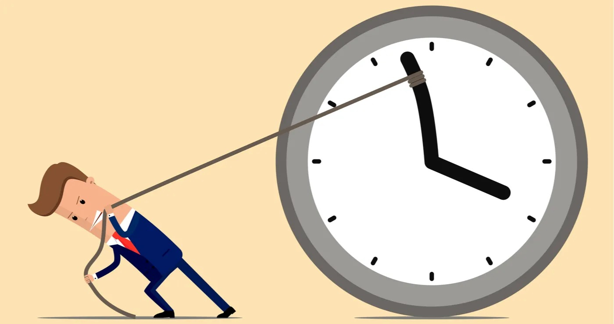

作者：何一涛 

日期：2023 年 9 月 24 日

涛然自得周刊主要精选作者阅读过的书影音内容，周末发布。历史周刊内容可以看[这里](https://www.heyitao.com/weekly)。

## 影音

[《德雷尔一家》](https://movie.douban.com/subject/26594369/)是一部根据书籍[《希腊三部曲》](https://book.douban.com/subject/3741374/)改编的英剧，共 4 季，每一季豆瓣评分都超过 9 分。

书的作者杰拉尔德.德雷尔是德雷尔一家中的小儿子，他只读过一年小学，却获得了世界上三所知名学府颁发的荣誉博士学位，他在保护濒危野生动物方面做出了杰出贡献。他出生于印度，三岁时父亲去世后全家从印度搬回了英国，十岁时全家人从阴郁的英国搬到了阳光海岛——希腊科孚岛，在这里他度过了快乐的童年生活，书和电影讲述的就是他们一家人的故事。

剧中不仅讲述了他快乐的童年故事，还讲了作为作家的大哥、有男子汉气概的二哥、有勇气的三姐以及为整个家操碎了心的妈妈的故事。他们如何适应美丽的海岛，如何与当地人和当地动物相处....这里不做剧透，留着你去发掘。

如果你被日复一日的工作快榨干了生命，想找回点生活的感觉，不妨看看这部英剧，感受下在海岛生活的快乐。

## 文章

1、[我生命中最重要的技能：对抗时间的加速](https://zhuanlan.zhihu.com/p/337417807)

很多人都会有类似的感觉：如果周末从工作地回了一趟老家，你会觉得这个周末时间过得特别长。类似这种空间切换（比如旅游）会让我们感觉一天的宽度增加了，反面情况是每周做的事差不多，你会感觉时间流逝很快。

时间加速的原理跟计算机工作原理类似，可以认为大脑为了减少工作量，对经常做的任务做了缓存，优化了工作的执行时间，让时间执行变快。对抗时间加速的方法是打破这个缓存机制，多去尝试新的事情。

文章作者也有类似的感觉，他根据这种感觉提炼出了对抗时间加速的理论：逃离人生中的熟悉区域，不断建立人生中的新鲜区域。并对具体事情的做了分类让实施起来更具有可操作性。

2、[时间、变革与刻舟求剑](https://mp.weixin.qq.com/s/kWGhcnbSGpfmP5yWtpwTSw)

对失去的事物、错过的人我们都会耿耿于怀，就像丢失了宝剑的楚人选择在船边上刻上记号，期望再次得到。楚人没有意识到的是，沉溺于刻记号的他，错过了沿途的美景，忘记了自己将要去的目的地。

要从刻舟求剑的故事中走出来，不妨借鉴下《被讨厌的勇气》的话语：「无论之前的人生发生过什么，都对今后的人生如何度过没有影响。决定自己人生的是活在此时此刻的你自己。」

3、[欺骗](https://mp.weixin.qq.com/s/Qi88t9lp54i-BC53ZgfWCQ)

自欺欺人是我们都存在的通病。你也许会觉得自己是例外。你大可回忆下是否责怪过别人，是否找过借口，对人对事是否有过偏见，是否自我欺骗过...如果有其中一条命中，都说明存在过自欺欺人现象。

阅读这篇文章以及文章提到的书（[《别找替罪羊》](https://book.douban.com/subject/30364340/)，早期引进来时也叫[《跳出盒子》](https://book.douban.com/subject/1175396/)）后，你会发现生活、工作中自欺欺人问题很普遍很严重，它会把我们困在思维的盒子中，很难意识到它的存在，更别谈如何从盒子里走出来。

我们常常提要坦诚，不仅仅对别人更要对自己坦诚。如果存在自欺但没有意识到，自我坦诚无从谈起。我们常常提要反省，经常审视自我，但当你处在盒子里，你会为自己的行为与想法不一致辩驳找理由把责任过错推给别人并觉得自己是正确的，这会让审视自我变得难以进行。

4、[Lawrence Yeo：休息之谜](https://rtw1bnq45a.feishu.cn/docs/doccnB85vVeJFnjY5xwwXkJtGNd)

休息是那些你不将把自我的价值和接下来要做的事情相关联的时刻。

5、[我们是如何榨干父母的？](https://mp.weixin.qq.com/s/Kf6UjTKcEhpimerAUPCdHg)

从千里之外赶来城市帮忙子女带娃的老人，活得不自由、无社交，他们与原来的社交圈隔绝，遇到代际冲突、心中郁闷等问题时往往无从消解。

那他们为什么还要来「受罪」？除了「面子」，很重要的原因是这一代老人普遍具有的奉献精神，只有通过对家庭不断奉献才能获得自我认同，这种过度奉献本质上特定生活环境下导致的独立性丧失。

这样的育儿结构，表面上看是年轻夫妻对老年父母的压榨，但从更深层面看是政府公共服务的缺位迫使在大城市安家落户的年轻夫妻必须向家庭内部整合资源的结果，这间接形成了对这一代老年父母的隐形剥削。

## 书摘

1、从社会制约下解放自我，最重要的步骤就是时时刻刻发掘每一事件中的回馈。如果我们学会在不断向前推进的体验中找到快乐与意义，社会制约的重担就会从肩上自动滑落。当奖赏不再受外在力量管制时，权力就回到了个人手中。再也不必为追赶不到的目标而孜孜以求，或是在每个无聊的一天告终时，盼望明天会更好；再也不必为遥不可及的奖励受尽折磨，而可以真正开始充实人生。但光是放纵本能的欲望，并不等于摆脱社会制约，我们还得超脱肉体的欲望，学习控制心灵。

---[《心流》](https://book.douban.com/subject/27186106/)

2、攀岩的神秘就在于攀登本身；你爬到岩顶时，虽然很高兴已大功告成，而实际上却盼望能继续往上攀登，永不停歇。攀岩的最终目的就是攀登，正如同写诗的目的就是为写作一样；你唯一征服的是自己的内心……写作就是诗存在的理由。攀登也一样，只为了确认自己是一股心流。心流的目的就是持续不断地流动，不是为了到达山顶或乌托邦。它不是向上的动作，而是奔流不已；向上爬只是为了让流动继续。爬山除了爬山之外，没有别的理由，它完全是一种自我的沟通。

---[《心流》](https://book.douban.com/subject/27186106/)

3、虽然一般人都很期待下班回家的一刻，准备好好享用辛苦挣来的闲暇，可是他们往往不知道如何利用这段时间。更讽刺的是，工作的乐趣比闲暇更多，因为工作有类似心流活动的内在目标、回馈、游戏规则与挑战，能使人投入，全神贯注，浑然忘我；然而闲暇却没有结构可言，必须花更多精力才能把它塑造成产生乐趣的形式。

---[《心流》](https://book.douban.com/subject/27186106/)

4、一家企业的文化是由许多因素构成的，而其中最重要的一个因素，便是清楚和重复地传达你的优先事项。凭我的经验来看，这一点便是伟大管理者之所以脱颖而出的关键。如果领导者无法清晰传达他们的优先事项，那么身边的人也就不清楚自己的优先事项是什么。这不仅会造成时间和精力的浪费，也会让你所在机构的人员因为不知道自己应该专注什么而承受不必要的焦虑。效率逐渐降低，不满逐渐堆积，士气也会逐渐消沉。

---[《一生的旅程》](https://book.douban.com/subject/35009826/)

5、我们不能沉迷于过去。过去那些糟糕的创意决策和让人失望的电影，我们无法挽回。但是关于改变未来，我们能做的却很多，而且需要现在就开始行动。

---[《一生的旅程》](https://book.douban.com/subject/35009826/)

<完>