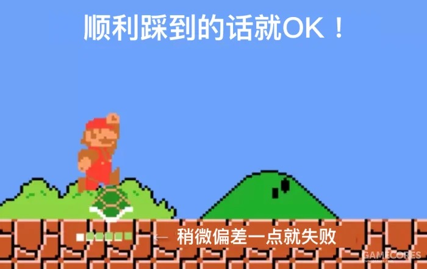
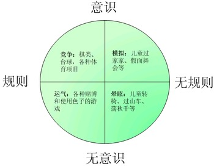

作者：何一涛 

日期：2023 年 9 月 30 日

涛然自得周刊主要精选作者阅读过的书影音内容，周末发布。历史周刊内容可以看[这里](https://www.heyitao.com/weekly)。

## 影音

[《无节制消费的元凶》](https://movie.douban.com/subject/25945379/)是一部总共 3 集的纪录片，豆瓣评分 8.8 ，揭示了商品消费设计技巧如何深度影响我们的生活，驱使我们不断购物。

这些技巧包括缩短商品寿命、利用人性弱点制造消费欲望、模糊节目和广告的界限、降低消费障碍以及针对孩子营销......面对无尽的消费选择，我们的欲望似乎永无法满足。

下次购物前，不妨问自己几个问题：

- 我真的需要这个东西吗？

- 我是现在就需要，还是可以等一等？

- 这个东西我能用多久？

- 是否有更便宜或更实用的替代品？

- 我购买这个东西是出于真正的需求，还是因为想追求潮流或满足虚荣心？

- 如果我不买这个东西，我会失去什么？

## 文章

1、[关于人类如何思考的17大总结](https://www.camelliayang.com/blog/morgan-housel-17)

原文是前《华尔街日报》专栏作家摩根·豪塞尔写的[How People Think](https://collabfund.com/blog/think/)，由理想屯球姐翻译，讲述了关于人的思维方面最常见最有影响力的 17 个方面，知识密度大，值得反复阅读。

下面摘几段我觉得还不错的，更多的精彩内容等着你阅读发现。

- 人们分享的大部分内容都是他们希望您看到的内容。美化了技能，隐藏了缺陷，夸大了胜利，淡化了失败。怀疑和焦虑很少在社交媒体上分享。战败的士兵和失败的首席执行官很少接受采访。

- 当你意识到你可以通过使用新的叙述方法去诠释旧有的概念，而无需从零做起改变世界时，你会发现事事皆有可能。

- 简洁是真理的标志，但复杂对人类有着病态的吸引力。当你为学术界的听众做了一场从头到尾都非常清晰的讲座时，听众们会觉得自己被欺骗了。令人痛心的事实是，复杂的东西更好卖。

- 我们生活在一个拥有大量简单的解决方案，但人们却懒得去遵循简单建议的世界中。伊萨克·阿西莫夫曾说过，「科学收集知识的速度比社会收集智慧的速度快多了」，这句话很好地总结了大多事情。

......

2、[暗知识：被忽略的知识类型](https://mp.weixin.qq.com/s/gaAO5CqKr7Pz3cMbJ3PYzw)

"听过了很多道理却没法好好过一生"的部分原因可能是没有习得暗知识。暗知识包括分散在每个人身上的知识、定量知识以及实践得来的知识。为了学习暗知识，我们可以与他人交流合作，进行大量阅读并刻意思考，以及亲自实践。此外，向人工智能学习也是一个获取暗知识的途径，因为人工智能拥有我们无法理解的暗知识，而大型模型的出现使得这些暗知识得以浮现。

3、[樱井政博：产生和提高游戏的乐趣的规律是？](https://www.gcores.com/articles/157456)

樱井政博，任天堂的明星制作人，开发了《星之卡比》和《任天堂明星大乱斗》等经典游戏。原文是他的演讲，他探讨了游戏性的本质。本文由罗峻旸翻译发布在机核网，适合对游戏感兴趣的玩家和开发者阅读。

游戏性可以用来衡量游戏的有趣程度，高游戏性代表游戏有趣，反之则无趣。在很多情况下，游戏性可以理解为博弈，也就是风险和回报。游戏设计的关键在于如何平衡风险和回报，文中通过介绍各种类型的游戏例子来说明这个理论。

以《超级马里奥》为例，马里奥与小乌龟的距离越近，风险越大。当距离足够近时，马里奥可以跳起来踩乌龟。然而，如果距离稍有偏差，马里奥就会失败，被乌龟碰掉血或挂掉。但如果成功，马里奥就能获得踩死乌龟的回报，此时玩家会感到满足。此外，踩完乌龟后，乌龟壳也可以被踢出去，扫平路上的其他怪物，获取高分回报。然而，这样做也有被反弹回来的龟壳击中的风险。

当然，风险和回报的大小并不是决定游戏性的唯一因素。每个游戏都有自己的目标人群。对于初学者来说，风险小、回报小的游戏更适合他们，否则他们可能会因为难度太高而放弃游戏。而对于资深玩家来说，他们需要一些风险大、回报大的场景设计来增加游戏性。

此外，游戏的乐趣并不仅仅来源于博弈。操控性强、剧情好、运动元素、创作元素和音乐节奏等都能为游戏带来乐趣。法国哲学家罗杰·凯卢瓦在他的书[《游戏与人》](https://book.douban.com/subject/1870905/)中，根据是否调动游戏者的意识和游戏本身是否具有规则，将游戏分为四类：竞争、模拟、运气和晕眩。博弈体现了竞争和运气。然而，现在的游戏通常是各种元素的集合体。无论如何，最重要的是把目标用户的体验放在第一位。

4、[孩子的自律, 能靠家长逼出来吗？](https://mp.weixin.qq.com/s/s7REM6X9_7eMxwVF-tWOWg)

要培养孩子的自律，首先父母需要尊重孩子并认可他们的行为。以身作则，对自己的行为负责，并为孩子提供自主的成长空间，避免过度干涉。同时，要注意孩子的精力有限，只需在核心问题上要求自律，其他问题上不必过于苛求。尤其不要用其他孩子的表现来要求自己的孩子。

5、[别为「升职」烦忧](https://mp.weixin.qq.com/s/3hr2qC2r9wff0ACGVXB_Xw)

我曾为晋升而烦恼，被紧张氛围所影响，恐惧被同龄人超越。但辉哥这篇文章让我明白，职级只是保证公司有序的制度，升职加薪是无止境的。因此，专注于个人成长才是最重要的。

## 书摘

1、冷静的想一下，有时你自认为是出于好心帮助别人可是别人却不领情，但是你真的是出于好心吗？你真的设身处地的站在对方的角度考虑过问题吗？还是仅仅为了表现自己的同情心或是为了树立自己的良好形象才伸出援手？遗憾的是，我们大多数时候都并非真正理解别人才那么去做的，因此在对方看来，你的所作所为不过是一种施舍，对方自然不会领情。于是，你便会由此确信，对方不可理喻不值得自己真心相待，自己必须针锋相对才行。误会由此产生，隔阂由此加深，而这一切仅仅是因为我们犯了自欺这样一个毛病。

---[《跳出盒子》](https://book.douban.com/subject/1175396/)

2、假如你困在盒子里，那么哪怕你做的事情在表面上看来是对的，也只能是收效甚微，不会得到积极的回应，这与跳出盒子后做同样的事差别会很大。人们对你举动的回应，主要不是取决于你做了什么，而是取决于你对他们的态度，你是否跳出了盒子的束缚。

---[《跳出盒子》](https://book.douban.com/subject/1175396/)

3、当然，你可以从这个例子中得到另一个教训，那就是困在盒子里的领导者会造成多么大的危害。他让别人很容易的就困在盒子里。因此，你必须避免这样，要想成为一个与众不同的领导者，那就是你身为领导的义务。当你困在盒子里的时候，你只需要强迫或威胁下属，他们就会也困在盒子里。但是，这不是领导力，而是威压。人们真正愿意跟从的领导是那种跳出了盒子的领导。只要你想一想过去的经验，你就会发现此话不假。

---[《跳出盒子》](https://book.douban.com/subject/1175396/)

4、思考是缓慢的、费力的和不确定的。尽管如此，人们还是喜欢思考——更精确地说，我们知道解决这一问题能够带来愉悦感后才会喜欢思考。所以说人们避免思考和人们天生好奇并不矛盾——好奇心使得人们去寻找新的主意和问题，但是我们会很迅速地分析解决问题需要多少脑力劳动，如果太多或太少，在允许的情况下，我们就会停止努力。
---[《为什么学生不喜欢上学》](https://book.douban.com/subject/4864832/)

5、工作记忆是大脑中思考发生的地方，我们将想法汇集在一起，得出一些新的主意。困难之处在于，工作记忆空间有限，如果想要同时思考太多东西，我们会犯糊涂，会搞不清待解决的问题、要读懂的故事或者做决定时要衡量的各个方面。拥有较大工作记忆容量的人在这些问题上表现较好。尽管我们不能给工作记忆扩容，我们也可以用两种方法让内容变小:通过合并使事实占用的空间变小，这在第二章谈到过，需要长期记忆中的知识;还可以通过压缩我们将信息带人工作记忆的过程，或者在信息到达工作记忆后巧妙地处理它。
---[《为什么学生不喜欢上学》](https://book.douban.com/subject/4864832/)

<完>