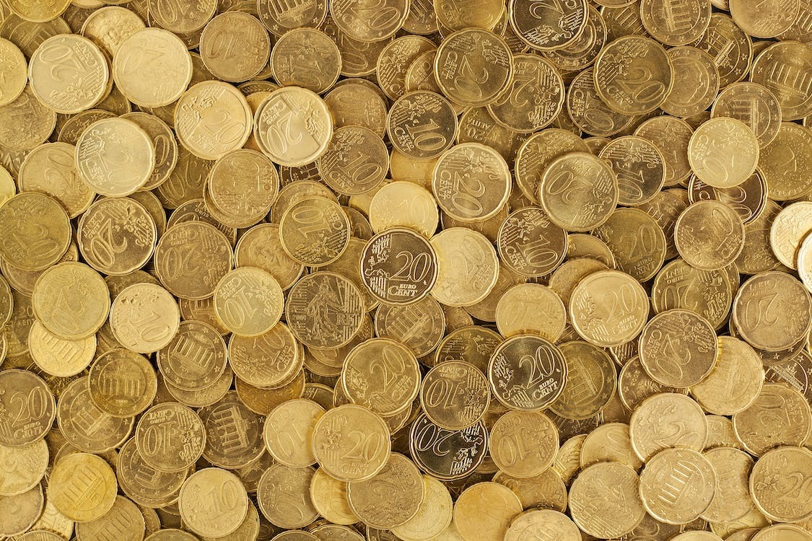
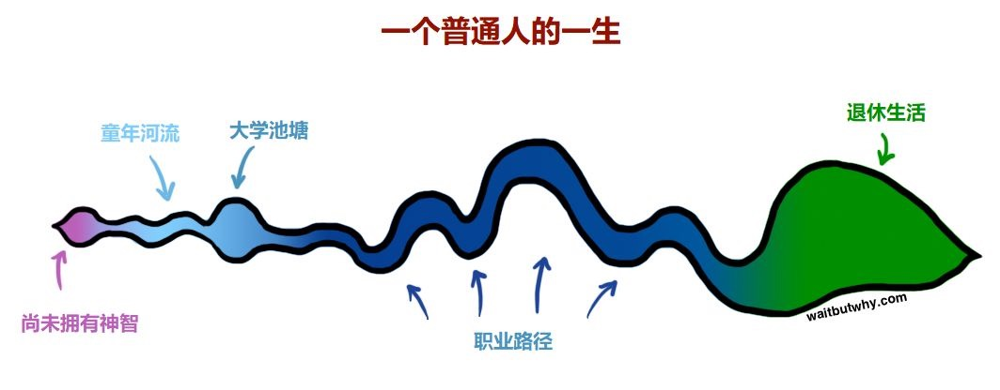

作者：何一涛 

日期：2023 年 10 月 9 日

涛然自得周刊主要精选作者阅读过的书影音内容，周末发布。历史周刊内容可以看[这里](https://mp.weixin.qq.com/mp/appmsgalbum?__biz=MzIxNzI1OTMzMg==&action=getalbum&album_id=3088144283867512833)。

## 影音

国庆假期，我看完了武侠探案剧[《莲花楼》](https://movie.douban.com/subject/35633163/)，感触颇深。特别是主角李相夷在东海之战前后的心态变化，让我深感共鸣。

战前的李相夷，热血沸腾，意气风发，他一门心思地追求成为武林第一，却忽视了对身边朋友的关心，为他日后的遭遇埋下了伏笔。东海之战后，他受到了沉重的打击，心如死灰，于是他选择放下过去的身份，化名李莲花，隐身在江湖版房车——莲花楼中。他厌倦了武林中权力的游戏，放弃了争霸的雄心，沉醉于平凡的田园生活，种萝卜，养土狗，一边给人看病维持生计，一边跟过去的自己告别。

这种心态的转变，与我近年来的心境变化十分相似。曾经的我，一心钻研技术，追求着成为技术专家的梦想，渴望赚取更多的钱财。现在的我，放弃宏大叙事，转向为自己做一些小而美的事。钱财只是手段不是目的，过好自己的生活，才是最重要的。

推荐没看过这部剧的朋友看看，或许通过李相夷的故事，你也可以「一念心清净，莲花处处开」。

## 文章

1、[金钱是身份的放大器](https://mp.weixin.qq.com/s/KrrTzhCSR4HNDatr-JT9yQ)

这篇文章的原文是[Money Is the Megaphone of Identity](https://moretothat.com/money/)，原作者 Lawrence Yeo 擅于用插图和通俗易懂的文字把一些生活相关的概念表达出来，给人以启发。建议先看译文，再看原文，原文中的参考链接内容也很丰富。

文章中提出的「金钱光谱」模型把我们与金钱的关系划分为三大阶段：「生存阶段」，「自由阶段」，「权力阶段」。每个阶段又细分为多个小阶段。每一个阶段都代表了金钱为我们设置的特定意义。

处于「生存阶段」时，人们会夸大原本可控的风险，害怕做不确定的事情。在「生存阶段」中所处的位置越低，就越会为金钱患得患失。摆脱这一阶的关键是意识到拥有的金钱足以满足基本的生活所需，只有这样，围绕金钱的恐惧才会逐渐消失，经历过的一切才会逐渐开始具备确定性。

进入「自由阶段」，开始具有了消磨闲暇时光的自由，即「休闲自由阶段」。这个阶段的问题是闲暇时间和工作时间并不对称。为了获得一个小时的闲暇时光，我们必须工作很长时间。如果不喜欢所从事的工作，从工作中也收获不了其他东西，那么会发现一生中超过三分之一的时间将只是在为钱奔波。除非等退休后，可以用养老金和攒下的钱去世界各地旅行，按照自己的节奏生活。但这样浪费了三十多年时间真的值得么？可悲的是，大多数人都止步在这一阶段。

只要金钱是工作时的首要考虑，就会被困在「休闲自由阶段」。除非转换下看待金钱的视角：与其把有钱看成辞职的前提，不如把它当作一块敲门砖，帮助找到有意义的工作。这样就可以进入「自由阶段」中的第二个阶段：「工作自由阶段」。

「工作自由阶段」中，成就感高于金钱。赚钱仍然重要，但它的主要目的超越了单纯的积累，而是让我们有自由去从事想做的工作。简单来说，就是同时满足钱可以维持生活、做自己想要的事。如果把这两点与互联网零边际成本的特质结合，就不难理解为什么现在越来越多的人逃离宏大叙事开始做一些伟大的小事了。

从「想做的事情」获得的收入超过维持事情运转下去的成本时，就会得到「成就感盈余」。这是一个人能拥有的最好的钱。不仅得到了超出自己所需的钱，而且是通过做一些即使分文不取也愿意做的事情赚到的。这会引导到达「自由阶段」的顶峰「注意力自由阶段」。在这个阶段，钱会为我们服务，它是一件工具，拥有它，就能做成自己喜欢的事，一旦实现了目的，就渐渐不会再去关注钱了。这是整个「金钱光谱」中最棒的地方：如果没有任何别的愿望或者欲望，那么大可以停留在此处。

如果决定上升到「权力阶段」，我们便不可避免地要步入「影响力之塔」。在那里，位置越高，权力交锋处的权衡取舍越会让人如履薄冰。在家庭内部通过钱施展影响力对我们来说也许易如反掌。但是想向某些社会群体和素不相识的人施加影响力，牵涉的利害关系就会变得更加复杂。一旦人的执念加深，恐惧就会再次主宰整个光谱。

所以问题来了：你认为你正处于这个光谱上的什么位置？你未来又想在哪个位置？是什么在阻碍你？是钱，还是你的心态？看完这篇文章，相信你会有自己的答案。

2、[本文不提供职业建议，却能助你一生](https://mp.weixin.qq.com/s/lbJr7-GxblWfzTf2CWTWYQ)

原文是国外知名网站 Wait But Why 作者 Tim Urban 写的 [How to Pick a Career (That Actually Fits You)](https://waitbutwhy.com/2018/04/picking-career.html)。在[第 8 期](https://mp.weixin.qq.com/s/nbs4k-dbk8gK1BdV1fhgcA)中也介绍过 Tim Urban 写的《驯服你内心的猛玛巨兽：停止在意别人的想法！》。

文章主要提供了一个职业路径自省框架，可以帮助我们更诚实的面对自我，达到「那些我犯的错误，真的是因我而起」。框架分三步。首先用「欲望八爪鱼」模型深入分析我们的欲望，用「书架」模型对欲望进行优先级排列，得到我们想要（与欲望相关）的职业；接着是分析现实生活中我们的潜力能够达到的职业；最后「想要」和「现实」重叠的地方就是我们的最优职业。

除了框架外， 文中还有个观点也很有启发：常规认知把职业看做是一条笔直可预期的管道，实际上个人职业发展路径更像是一连串连接起来的点。我们只需专注于路径上接下来的那一个点，不用过多担心更后面的点。

3、[怎样当好一名师长](https://www.marxists.org/chinese/linbiao/mia-chinese-linbiao-193612.htm)

文章阐述了成为一个优秀的军事指挥员应具备的九个方面的素质，适合管理者研读并落实到工作中。

4、[钱颖一对话彼得·蒂尔:逆向思维之道](https://mp.weixin.qq.com/s/cSE9kJdKTdlIZGr3ID-COQ)

这是一篇 2016 年的对话，谈到了逆向思维、过度全球化、创新等话题。现在来看，依然很有启发，比如对逆向思维的理解。

真正的逆向思维不是与别人意见不同，也不是与周围人唱反调，而是独立思考，不人云亦云。

逆向思维是探索你感兴趣但别人还没发现其有趣之处的方面，提出没有人问过的好问题是一个好的起点。

5、[什么东西是时间的朋友？](https://mp.weixin.qq.com/s/0eeZrPgrzZSXJeluRfSGkA)

所谓时间的朋友，就是指做某些事会随着时间增值，或者不会那么快贬值，也可以理解为半衰期长的事。

除了大家熟知的被动收入，有用的技能、好的信用、真正的朋友、写作也都是时间的好朋友。这些朋友在我们生活的世界中也是非常有用的。

但在我看来，时间的真正朋友是可以穿越时空的。比如少数优秀的文学作品，作者赋予了它们独立的生命，可以在作者死后继续存活，我们通过阅读这些作品与它们对话。这些作品可以流传千古，成为我们和过去对话的桥梁。

## 书摘

1、就像在玩一个天平游戏，你以为满足基本温饱再去追求兴趣，成功会自然而来，却不知道你一天只有24个小时玩这个天平游戏。你以为虽然得不到爱，但能赚很多钱，这样自然就会有爱。于是钱成了爱的替代品。然而，当你用钱寻欢作乐时，你会发现，你已经买不起“爱”了。同样，一旦你习惯用外在奖赏而非兴趣、好奇心奖励自己，久而久之，你就会发现，你已经买不起兴趣和好奇心了。

---[《内在动机：自主掌控人生的力量》](https://book.douban.com/subject/35182454/)

2、时间是一个不可信赖的伙伴，无论每一秒显得多么漫长，生命都会在转眼间结束：我们出生，有自己的起源和传承，尽全力去摆脱这种预先设定好的命运；也许我们成功了，但很快就会发现，我们必须一路回到那个来处；如果不能到达那里，我们就永远不能真正地完成自己。就这样，我们顿悟了，仿佛一辈子都生活在一口黑暗的井中，对于自己到底是谁一无所知。然后突然有一天，一切都晚了。

---[《鳗鱼的旅行：一场对目标与意义的探寻》](https://book.douban.com/subject/35167939/)

3、如果我们不知道自己来自哪里，我们也就不知道自己要去哪里。离家和回家遵循的是同样的路线。

---[《鳗鱼的旅行：一场对目标与意义的探寻》](https://book.douban.com/subject/35167939/)

4、那些赞美你的人，想要为自己赢得你。而批评你的人，则想通过贬低你来抬高自己。又或者他们想通过展示你的错误来为自己的错误辩解。批评和赞美是控制性游戏中狡猾的人用来限制愚蠢的人的工具。

---[《聪明人的圣经》](https://book.douban.com/subject/1101606/)

5、如果你在自己的生命中有一个具体的目标，并为此而工作的话，你的生命就会像建立一座金字塔一样。每一天都是一块石头，你堆积它们。如果你在做每一个决定时都能看到整座金字塔的话，你就用每一块石头加强了自己的整体的力量。你总能知道，你为什么做一些事情。这会赋予你的生命克服一切困难的力量。

---[《聪明人的圣经》](https://book.douban.com/subject/1101606/)

<完>