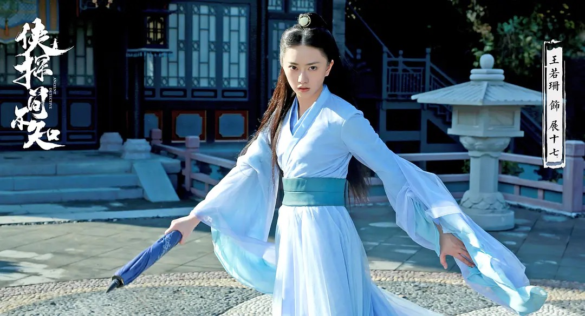
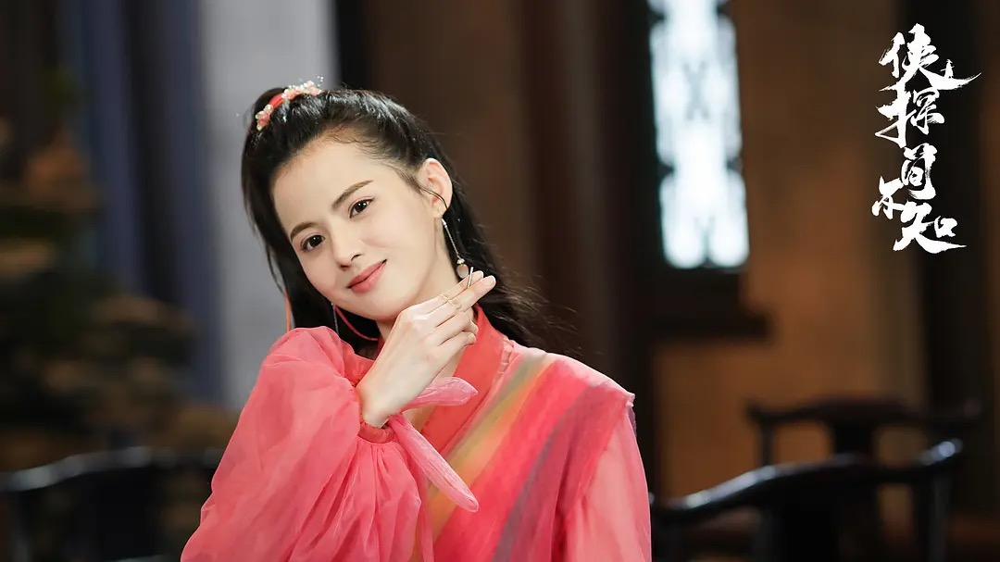
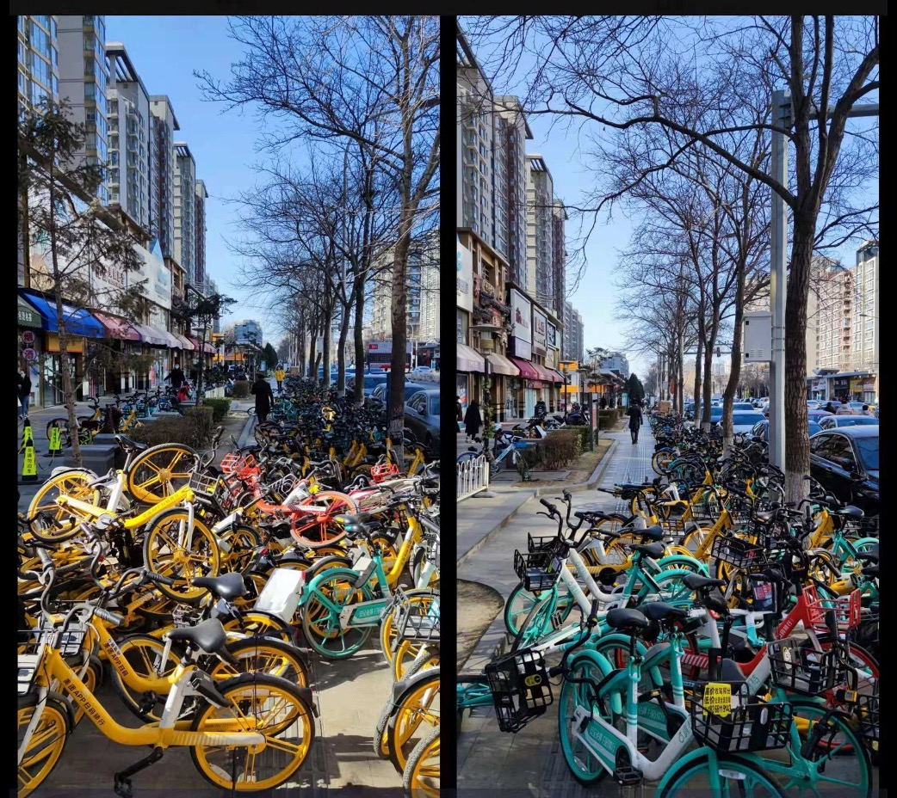
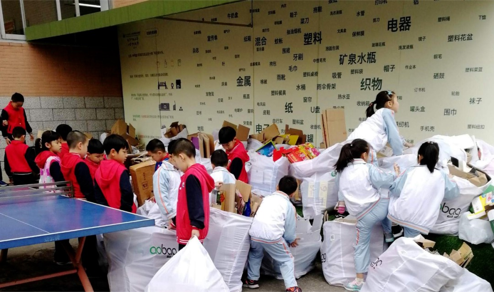
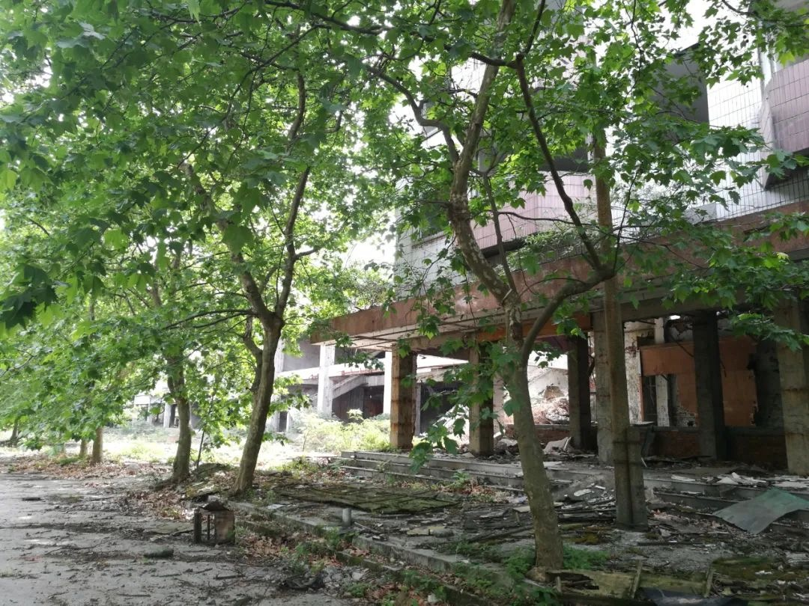

作者：何一涛 

日期：2023 年 10 月 21 日

涛然自得周刊主要精选作者阅读过的书影音内容，周末发布。历史周刊内容可以看[这里](https://mp.weixin.qq.com/mp/appmsgalbum?__biz=MzIxNzI1OTMzMg==&action=getalbum&album_id=3088144283867512833)。

## 影音

[《侠探简不知》](https://movie.douban.com/subject/30371563/)是一部武侠背景的探案剧，讲述失去了记忆的神机谷少谷主简不知，为了查出多年前神机谷大战的真相独自闯荡江湖，结识了好友和挚爱的故事。

这是一部古龙风格的武侠剧，打斗精彩，某些部分还很搞笑，除了男女主角，其他配角也很有特色，每个角色都有一段自己独特的故事。为兄弟两肋插刀的王屋山大侠赵我还，随时随地收集江湖情报的录院第一美男子司马当，放弃状元只想做小偷后来不小心偷了少女心只想避风头的盗圣，颇具神秘气质的叶笑笑，长得像痴情的小妖女......

哦，对了，本剧有 24 集，这是部悬疑片，记得一定要看最后一集。如果看完了仍觉得不过瘾，记得去优酷搜索下「侠探简不知番外」，有惊喜等着你。

## 文章

1、[嫉妒是灵魂的癌症](https://www.feishu.cn/docx/QPpsdRiNForV65xXY3vcEsk9nle)

文章由原文[Envy Is the Cancer of the Soul](https://moretothat.com/envy/)翻译而来，探讨了嫉妒这一人类很少坦率承认的通病，可以结合作者另外一篇文章[The Antidote to Envy](https://moretothat.com/the-antidote-to-envy/)(机翻译文：[嫉妒的解药](https://www.feishu.cn/docx/QHUddJBqwosXsdxXah5cEOHMnAg))一起阅读。另外嫉妒来源与模仿欲望，也可以与产品沉思录中的文章[妒忌与暴力的根源：模仿欲望](https://pmthinking.com/%E5%A6%92%E5%BF%8C%E4%B8%8E%E6%9A%B4%E5%8A%9B%E7%9A%84%E6%A0%B9%E6%BA%90%E6%A8%A1%E4%BB%BF%E6%AC%B2%E6%9C%9B)进行关联阅读。

嫉妒是一种普遍的情绪状态，不过大家都不太愿意讨论它。谈论嫉妒会让人觉得自己很无能，这相当于是自己否定自己，破坏了自己在他人心中的形象。我们通常会选择把嫉妒隐藏起来，尽量不要让别人发现。

嫉妒起源于模仿欲望。比如说，你的朋友家庭殷实，气质优雅，有一个漂亮的女朋友，而你却穷困潦倒，身材发福，孤苦伶仃。你们经常在一起聊天吹牛，除了这些之外，你觉得其他方面并不比他差。你会嫉妒你的朋友，下意识地模仿他，但并不是真的想成为他，而是想拥有你没有的东西。人的嫉妒产生于对身边人的模仿而无法实现，这种情况很难清除。通常来说，人不会嫉妒离自己很远的人，无论是距离还是地位方面的远。所以，如果想减少嫉妒，你可以考虑离你嫉妒的人远一点。

更彻底的方法是向内求。嫉妒是因为把别人的欲望强加在自己身上，如果专注于自己，则自身就可以填满，这样就不会有别人的欲望存在的空间，自然就没了嫉妒。

借用文中的说法：「嫉妒与自我审视成反比。你越不了解自己，就越会从别人那里了解自己的价值。但你越深入了解自己，就越少向他人寻求帮助，嫉妒的消解也就开始了。」

2、[我们在这条路上总共找到了543个盲人的心烦点，他们最绝望的时候是走到立交桥下](https://mp.weixin.qq.com/s/cdkoyamBMU5Qj6EU6CsQzQ)

这是城市规划师茅明睿做的演讲《关于出行的三个承诺》，讲述了三个用科技来解决公共问题的故事：用盲杖雷达收集盲道的无障碍问题，提升盲人出行使用体验；监控共享单车的蓝牙信号，让共享单车摆放更合理；利用政府的巡逻车收集环境数据，结合城管人工复查，解决区域环境问题。

3、[五年前我在一席分享了我们当时垃圾分类的做法，五年以来我一直在后悔](https://mp.weixin.qq.com/s/-mpIOhX3LfjTBMpzwwvsyA)

通过环保袋收费，筛选一部分意愿强的人做垃圾分类。用市场价回收分类好的垃圾，出现出错分类时给予反馈，形成正循环。再与社区合作解决掉垃圾分类回收点成本和位置的问题。这样的垃圾分类可以发动很多年轻人都去做，长此以往，也许可以改变一代人的环保观念。

4、[人类历史上最大的一场末日工程，大三线建设始末](https://mp.weixin.qq.com/s/7pENryOueE2VllpYuRZvOA)

很多人都不了解大三线建设这段历史，一部分与国家刻意不做宣传有关，一部分原因是三线建设大约在 1980 年左右结束。我最早是在《江城》这本书上看到，后面到处翻阅，直到找到九边这篇文章，算是普及了这方面的一些知识。

三线工程是我国在特殊历史时期应对外部压力，保障国家安全的战略决策。在当时的美苏夹击和印度边境威胁下，新中国通过实施三线工程，成功地将战争威胁降到最低，保障了国家的安全。尽管三线工程在很大程度上影响了我国工业化进程的速度，但这一工程的实施，为我国积累了丰富的工业建设经验，为后来的改革开放和现代化建设奠定了坚实的基础。

可以结合故事 FM 第 646 期[《三线厂小镇奇谈：我曾经的家如今是末世景象》](https://mp.weixin.qq.com/s/ScomSF4m6OsXF81HM2KToQ)来看，讲述者七月从小在四川汉旺东方汽轮机厂长大，是正经的三线厂子弟，后来他基于这些记忆写了一本小镇青年拯救世界的奇幻小说[《小镇奇谈》](https://book.douban.com/subject/35556905/)。

5、[致三十六岁的你](https://mp.weixin.qq.com/s/Xf9_OnbQ9dkusqZHl-TySg)

人生困惑多多，随着人类的三种基本心理需求而波动，而在三十六岁时，人们需要敲响自己的内在时钟，保持自己的节拍，以实现自主、胜任和归属的平衡。

## 书摘

1、在1787年的立宪会议上，最重要的问题不是“谁应该当总统？谁应该领导我们？谁是我们当中最聪明的人？谁是最好的国王？”绝非如此！美国的建国先贤们致力思考的问题是：“我们能够创建什么样的程序，使国家在我们身后仍然能拥有很多优秀的总统？我们希望建立哪一种长治久安的国家？要靠什么原则来建国？国家应该如何运作？我们应该制定什么指导方针和机制，以便创造我们梦想的国家？”

---[《基业长青》](https://book.douban.com/subject/1022936/)

2、做事不太理会法律或治理制度，是根深蒂固的中国文化。在新加坡，我们已接受必须像西方那样，由立法机构决定法律的措辞，再由独立的法院和法官确定这些字句的含义。中国人还没有接受这一观念。同样地，他们也还没有接受签署协议是不可更改的观念。在他们看来，签署一份协议只是长期友谊的开始。作为朋友，你们必须不时地商量，你们之中谁是否多挣了钱，谁是否需要掏出更多的钱。这种含糊不清的概念还反映在他们对制度的看法上。在中国，人大于制度。因此，你可以当国家主席，但是如果没有军队的支持，你这个国家主席就大不一样。但在新加坡、英国、欧洲或美国，如果你是总统或总理，军队领导人自动地接受你的命令，因为制度大于人。

---[《李光耀观天下》](https://book.douban.com/subject/26413154/)

3、撇开空话不谈，美国人从根本上相信明天会更好。这说明他们为何会倾向于消费，借贷，再消费。中国人和日本人却总是认为随时可能发生地震或其他灾难，所以觉得有必要储蓄以未雨绸缪。我很佩服美国社会的乐观主义：他们乐于尝试的生活态度；认为只要有了相关资源，每一个问题都可以解决；以及什么东西都可以分解、分析和重新定义。但是我可能不会想永久居住在美国。如果我是个难民，如流亡加利福尼亚州的前南越总理阮高祺，我大概会选择去英国，那里的社会压力会小些。

---[《李光耀观天下》](https://book.douban.com/subject/26413154/)

4、新加坡于1965年独立时，中华总商会的一组代表向我游说，希望将华语选为国语。我对他们说：“你得先把我打倒。”将近50年过去了，历史显示能讲英语并与世界沟通的能力，已成为新加坡的成长故事中最为重要的因素之一。其他国家，如英国、德国、法国、荷兰、澳大利亚等等。这些国家做生意是用英语，不是华语。未来无论什么时候，如果我们考虑将华语定为工作语言，那将是愚蠢的。现在，就连中国人从幼儿园到大学都在疯狂地学习英语。

---[《李光耀观天下》](https://book.douban.com/subject/26413154/)

5、我们应当教育我们的孩子保持谦卑和好奇心。保持谦卑，意味着要认识到我们的本能通常会妨碍我们认识到事实的真相。它意味着我们要认识到自己知识的局限性。它意味着我们应当很坦然地说“我不知道”。它还意味着，等你形成了一个观点之后，要随时准备接受新的事实来改变你的观点。保持谦卑是一件轻松愉快的事，因为它意味着你不需要对所有的事情都有了解，或者都有观点，你也不必随时准备为你自己的观点而辩解。保持好奇心，意味着你应当对新的知识和信息保持开放的心态，并且积极地寻找新的信息。它意味着你能够拥抱和你世界观不符的事实，并且可以努力去理解它们背后的含义。它意味着让你的错误激发自己的好奇心，而不是难为情。我怎么会错得如此离谱呢？我能够从这个错误中学到什么呢？那些人都很聪明，那么为什么他们会使用那种解决方案呢？保持好奇心是一个令人激动的过程，因为它意味着你永远都会发现有趣的事情。
---[《事实：用数据思考，避免情绪化决策》](https://book.douban.com/subject/33385402/)

（完）