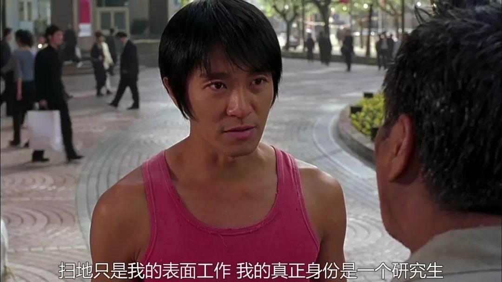

每周分享阅读过体验过的事物，更多详见[历史周刊内容](https://mp.weixin.qq.com/mp/appmsgalbum?__biz=MzIxNzI1OTMzMg==&action=getalbum&album_id=3088144283867512833)。

**1. 努力是没有用的**

《老夫子》作者、台湾漫画家蔡志忠做过一个[努力是没有用的](https://www.yuque.com/book-academy/share/shp7tu)演讲，讲到了要找到自己喜欢的事情，不断克服困难，做到极致，而不是一味地努力。

> 为什么努力是没有用的？老师或父母老是说努力努力就会走到巅峰——才怪。如果这样，不是所有人都走上巅峰了吗？没有人开始不努力，为什么后来不努力，因为努力没有效果。人生不是走斜坡，你持续走就可以走到巅峰；人生像走阶梯，每一阶有每一阶的难点，学物理有物理的难点，学漫画有漫画的难点，你没有克服难点，再怎么努力都是原地跳。所以当你克服难点，你跳上去就不会下来了。就像你学会语文，即使你十年不讲，碰到状况就会讲；就像学脚踏车，十年没骑，碰到脚踏车一上去就可以上手一样。

> 当然不是说不去努力，努力只比不努力好一点而已，是要会思考。我的结论就是人生其实很简单，只要你找寻你最拿手、最喜欢的事物，把它做到极致，无论做什么，没有不成功的。你做迷魂汤、做水晶包或做漫画家、工程师，都一样。

**2. 如何让你的工作更具有反脆弱性？**

[《反脆弱》](https://book.douban.com/subject/25782902/)是塔勒布写的关于如何应对不确定性世界的行动指南。书中把从外部风险中获利的能力称为「反脆弱结构」，核心有两点：选择性、正向收益，作者称之为「杠铃策略」。具体到职业发展上，就是放弃单一的中庸职业，让自己永远保留「最保守的职业」和「最激进的职业」两个选择权，而且总收益为正。

> 爱因斯坦在专利局上班的同时，研究相对论；卡夫卡白天在劳工事故保险局工，晚上回家写作，他从来不发表任何作品，因为这些年他事业顺利，从助理员一直升到总秘书；还有刘慈欣，在电厂做工程师的同时，完成了他所有的科幻作品……这些都是典型的“最保守”和“最激进”组合的“杠铃策略”，一是有选择权，人生在两个方向上同时下注；二是上班的收益高于事业颗粒无收的风险，总收益为正。

实现「可选择」相对容易，下班后干点自己喜欢的事，成为「斜杠青年」就可以。但实现「正收益」相对难些，其中一个关键条件是主业和副业的成本可以共享，特别是30岁之后最贵的时间成本。

「杠铃策略」具体落地要结合职业特点来进行，简单来说就是「保守方案」加「不断试错」。拿程序员这个职业来说，职业内一方面用自己最舒服的方式写代码省出时间，一方面要以自己最不熟悉的方式写代码探索新技术；职业外，可以利用职业本身建立的优势，努力往行业自媒体大V方向发展，节省成本。

相关阅读：

- [反脆弱性：为什么工作越稳定，人生越脆弱](https://mp.weixin.qq.com/s/tCBaij1cex47rfbzIWICsw) 

- [反脆弱：为什么有些人更能适应工作的剧烈变化？](https://mp.weixin.qq.com/s/IEUj4ovdbaysg0rbMQfDZg)

**3. [最难的是「做自己」](https://mp.weixin.qq.com/s/Yg9bCjKVbZPQ849fupj3Yw)**

> 除了你自己之外，没有人真正在意你究竟是谁，你究竟喜欢什么，你究竟希望有什么样的成就。他们对你发的朋友圈消息有议论，只是稍稍占用了磕瓜子的时间而已，你以为他们真的在意你？所以，如果连你也不在意你自己，那么这世界上真的没有人在意你自己了。

**４. [什么是费曼技巧](https://www.zhihu.com/question/20585936/answer/731163030)**

> 如果你不能用自己的话通俗易懂地把一个新知识点讲出来，说明你没有真正理解它。

**5. [如何记住你所读的书？](https://mp.weixin.qq.com/s/KPhboLtvznSTpzqqO9Wbxw)**

> 在选择书籍方面没有任何规则。我们不必阅读畅销书，或经典之作，或其他人都赞不绝口的书。这不是学校，没有必读书目。事实上，读别人不读的东西会有好处，因为你会获得别人没有的知识和见解。专注于一些书籍的组合。1）经得起时间的考验；2）激起你的兴趣；或3）挑战你。

> 定期问自己这样的问题。我可以从这个故事中学到什么？这本书中哪些内容与我自己的挑战相似或相关？有哪些不同之处？我如何应用我所获得的一些见解？

 

阅读你喜欢的书，直到你爱上阅读。记录阅读中的所思所想，将书中知识与你已有知识联系起来。把费曼技巧把书中内容讲给别人听，并运用到实际生活中。这里顺带推荐本人在用的卡片笔记方法，理论方面书推荐[《卡片笔记写作法》](https://book.douban.com/subject/35503571/)，实践方面推荐笔记软件 flomo 作者写的[《笔记的方法》](https://book.douban.com/subject/36615020/)。

**6. 学习面对死亡**

在我们生活中，死亡是一个忌讳的话题。面对亲友重病，医生回天乏术，我们往往抱着侥幸的心理去做无效的抢救，不但使病人受罪，还花掉了很多冤枉钱。难道就为了成全自己的孝心吗？学会最后的告别，是我们需要学习的一项技能。

相关阅读：

- [关于死亡，这是一篇颠覆你认知的文章](https://mp.weixin.qq.com/s/VSLSoBreIc7gShombaYlWA) 

- [《最后的告别：关于衰老与死亡，你必须知道的常识》](https://book.douban.com/subject/26576861/)

**7. 对失败的归因**

> 人们习惯把别人的失败归咎于错误的决策，而把自己的失败归咎于糟糕的运气。在评价你的失败时，我很容易从因果关系的角度来构建一个清晰而又简单的故事，因为我不知道你脑中当时在想什么。“糟糕的结果一定是糟糕的决策导致的”——这是我认为合理的原因。但在评价自己时，我就会编织一个圆满的故事来为自己的决策找理由，而将失败归咎于风险。
> --- [《金钱心理学》](https://book.douban.com/subject/36415996/)

