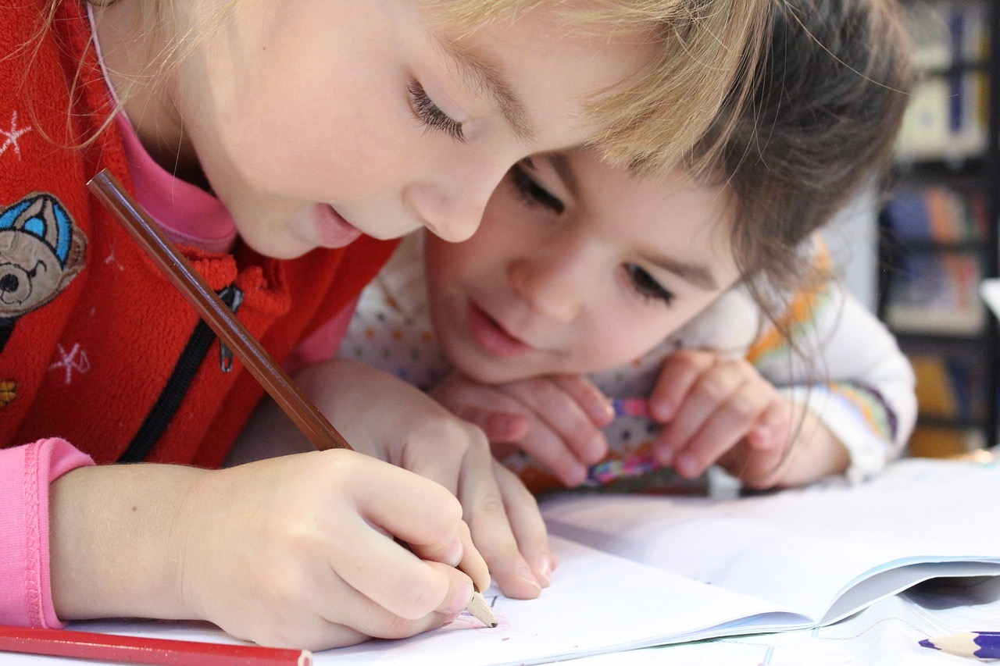
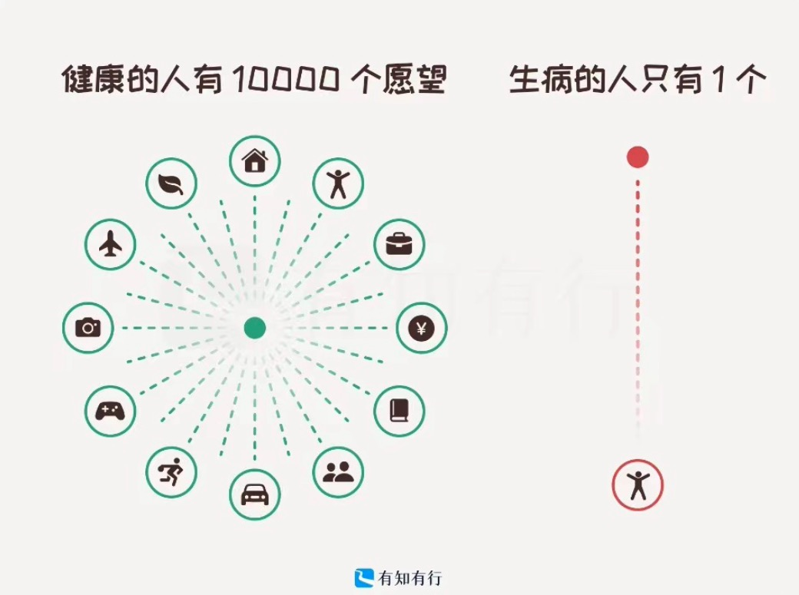

每周分享阅读过体验过的事物，更多详见[历史周刊内容](https://mp.weixin.qq.com/mp/appmsgalbum?__biz=MzIxNzI1OTMzMg==&action=getalbum&album_id=3088144283867512833)。

**1. 职场中被忽视的秘密武器**

写文档是职场上一项被很多人忽视的重要能力。对个人而言，写文档能够帮助理清思路，提升表达能力，降低沟通成本。当你将文档公之于团队，不仅获得了技术影响力，也减少了不必要的打断。写文档还是其他任务的基础，比如为领导编写报告、写各种总结......如果你平时有积累，这些任务将变得轻而易举。

对于团队来说，文档是宝贵的资产。它能帮助新成员更快地适应环境。同时，也让老同事得以发挥其经验和先发优势，不必亲自教导每个细节，可以解放出来做更有价值的事情。写文档可以使得不善于表达的同事也能获得平等的话语权，更好地在团队中找到自己的位置。写文档还可以减少开会的需求，让团队的整体工作效率更高。

好的文档具有生命力，不仅公司内的人可以看见，优秀的文档也可借由公司的宣传被公司外的人不断引用。随着时间的推移，它们可能会为你带来意外的惊喜，比如给你提供一些不可多得的机会。

然而，写文档也有缺点，它耗时耗力，尤其在忙碌时可能难以顾及。文档需要更新，否则其价值会大大降低。虽然文档可以减少开会的需求，但并不能完全替代面对面沟通，二者应该结合。

我个人有意识地写工作文档多年，从最初的团队文档整理，到经常分享有价值的工作经验，到现在经常鼓励别人写文档，我从中获益良多。在T公司，我经常将文档分享到公司内网积累积分，收获了很多许多小礼品，其中有一篇还曾被公司内宣发现，让我实现了人生中被采访的小愿望，帮助我荣登公司了公众号......写工作文档是一种表达方式，它也让我开始养成记录生活点滴的习惯，于是我开始写博客，记录所学所想，虽然还没有什么成就，但是想写就写这个事情本身就充满乐趣。用 flomo 的 slogan 来说：持续记录，意义自然浮现。

相关阅读：文档的惊人力量 https://www.feishu.cn/docx/WvOudhwRho8BkmxP3BgcJnNYnld

**2. 六种财富**

提到财富，大家首先想到的就是金钱。然而，除了金钱之外，人生还有许多其它财富形式：知识、时间、健康、关系和经历等。

金钱是最明显的财富形式，因为它可以量化。也正因为它这么明显，人与人之间玩起了金钱竞争游戏。「人们忽略的是，超过一定程度后，金钱就是一个诱人的记分牌，但却不能很好地衡量财富。它的收益是递减的。」

知识是创造财富的重要工具，同时它本身也是一种财富，广博的知识和精巧的技艺本身就有很高的价值，能够给人带来快乐、尊重和名望。

时间是一种容易被忽略的财富形式。「就像氧气一样，当时间充裕时，我们会忽略它，但当它变得稀缺时，我们就会拼命想要得到更多。如果你花光了所有的钱，你还可以赚更多。当你的时间耗尽时，游戏就结束了。」

健康是人生最重要的财富之一，就像时间一样，当我们拥有健康时，很少会想到健康。但一旦失去了呢？它就是你唯一能想到的东西。「健康的最大价值在于它给你带来的可选择性。当你身体健康而身无分文时，你有很多选择。如果你卧病在床却很富有，那又有什么意义呢？如果你无法享受，十亿美元又有何用？」

人是活在社会中的，良好的人际关系能够给我们带来幸福，让我们的人生更加充实。「如果生活中其他方面都很丰富，但人际关系却很匮乏，那么这种生活充其量只是空虚，最糟糕的是令人沮丧。如果没有人与你分享，拥有世界又有什么意义呢？如果做国王意味着要住在一个人的城堡里，你真的想做国王吗？」

「人生的目的就是去经历那些你以后会怀念的事情。」我们用其它形式的财富换取难忘经历的机会，这些丰富的人生体验在当时会给人带来强烈的美好感受，在以后也会像复利一样值得不断回忆。「在你生命的最后时刻，你是愿意回顾与你关心的人一起度过的快乐时光，还是满足于自己没有在这些琐碎的追求上 "浪费时间和金钱"？」

知道人生中有多种财富形式有很重要的意义。我们最终是要把时间、健康、金钱、知识等用于获取更美好的人生体验。金钱带来的边际收益递减，金钱只是一种手段而不是人生目的，不要追求金钱而忽略了自己的健康、关系和人生体验。我们还需要在人生不同阶段平衡各种财富形式，年轻时，不要过于在乎金钱，要多去体验不同的人生；在中年时，时间较少，应该少加班，用金钱换取时间，多陪伴家人朋友，体验生活的快乐。

相关阅读：

- 六种财富 https://www.feishu.cn/docx/LTdDdiDSvoTpjNxXXUmcETewnsA

- 《人生最优解》 https://book.douban.com/subject/36242339/

**3. “神药”终结者**

随机双盲大样本是从医学界产生的科学概念，随机排除了个体差异，双盲排除了主观偏向，大样本排除了偶然性。随机双盲大样本实验是因果判定缺陷的修订者，也是幸存者偏差的纠正者。一种新药能不能用于临床投入市场，随机双盲大样本实验是非常重要的“金标准”。

在互联网企业普遍采用的 A/B 测试的基础就是随机双盲大样本。设计良好的 A/B 测试能帮助快速验证一个功能的好坏，减少想当然的决策。当积累足够多的好决策，可以让产品产生质的飞跃。

掌握随机双盲大样本原理，还能提升我们的科学思维能力。

> ❶学会不从零星言论中归纳出普遍结论，理解世界的多样性；

❷学会评估，一个重要的结论可能只是产生于偶然，不再轻信幸存者案例；

❸我们会知道消除主观偏见有多么困难；

❹不再迷信权威和个人，相信高标准的实验手段； 

❺我们将学会看穿非科学疗法和其他江湖郎中的把戏；

❻从概率思考到批判性思考，练习反直觉思考能力，从内心深处接受自我批判性思维。

相关阅读：[“神药”克星：随机双盲大样本](https://mp.weixin.qq.com/s/3uP3EzAEHTALpHySBHtQ3Q)

**4. 没有人是平庸的**

我们的大脑喜欢通过分类来简化事物，比如把人分为普通人和优秀的人。这种分类假定符合某些世俗标准的就是优秀的人，反之则是普通人。但其实我们不是二元的，而是多元的。有些特点容易显现，可以转换成金钱等形式，有些特点则不能直接挣到钱，但可以提升个人幸福感。每个人的成长环境不同，点的技能点也不一样。在时间的积累下，每个人都会有自己擅长的领域。关键在于，这些擅长的领域能否在日常生活中体现出来，带来快乐和反馈。

当你感到自己平庸时，不妨试着走出自己的圈子，在更大的环境中发现自己。比如可以加入主题社群或线下组织，参加感兴趣的活动，在网上分享经验，了解不同的领域和行业，接触更多的陌生人。这样一来，你或许能够发现自己的特长和潜力，从而拥有更多的自信和快乐。

相关阅读：没有人是平庸的 https://mp.weixin.qq.com/s/q9TZqO9LNIXORVYSGICBQA

**5. 我必须把我从地狱里拿出来**

茨威格在《人类群星闪耀时》中写道：“一个人生命中的最大幸运，就是在他年富力强时，发现了自己的人生使命。”

当清洁工王柳云在央视第九频道的一部纪录片中，看到一位没有绘画基础的老太太在一周内画出了一盏马灯时，50岁的她受到了深深的触动和启发。那一刻，她开始想要学习画画，也就在那一刹那，她无意间发现了自己的人生使命。

接下来的事情就顺理成章了：她全身心地投入到绘画中，向周边的人学习，不断练习，打磨自己的作品。她的成长速度令人咋舌。尽管生活环境依然艰苦，但她通过绘画找到了精神自由，让自己从生活的地狱中挣脱出来。

像大多数中国传统女性一样，她依然被生活禁锢，被丈夫牵绊，但她坚信，她已经找到了自己的天命。当她画画的时候，她的灵魂不再被困在这间狭小的房间里，而是在高山之巅，在大海之渊，在淙淙的溪流与翻卷的海浪之间自由翱翔。

> 反正，有思维有意境，你就画。我一辈子都在观察自然界里真实的东西，所以我到了要画的时候，就像一位诗人写的，我的身体里一堆落叶，就是我的身体里面已经挤满了各种各样的思维，那么提起笔的时候，就是蝴蝶从窗口飞出来而已。

相关阅读：

- [当清洁女工成为画家：50岁，我的绝望终于有地方放了](https://mp.weixin.qq.com/s/ajFoeqHzIzPZutk8zgmq4g)

**6. 摘录**

近期读了《人生最优解》，摘录几段。

> 死亡让人醒觉，越靠近死亡就越清醒。当终点临近，我们突然开始思考：我这是在干什么？我为什么要等这么久？在此之前，我们大多数人似乎都觉得自己拥有无尽的时间，并用这样的态度生活着。

> 只要你与其他人分享一项体验的回忆，就会产生复利。因为你与他人互动，分享曾经的体验，这本身就是一种新的体验。你与人交流、开怀大笑、建立关系、给予建议、提供帮助、变得脆弱——这些都是你日常生活的内容。获得体验不仅让你的生活更加投入、更加有趣，还能让你有更多东西和他人分享，这就像生意带来更多生意。正面体验具有良好的传播度与感染力，能引发连锁反应，释放更多你意想不到的能量。一加一可以大于二。

> 烟只是为了装酷来吸引女生，但是，现在女生已经和他好上了，为何他还继续抽烟？只因为他染上了烟瘾。习惯是难以戒掉的。对一些人来说，赚钱也是一样的，日复一日地重复一份工作要简单得多，当这份工作能让你持续赚钱时尤其如此——金钱是社会对你工作表现优异的一种普遍认可方式。一旦你养成“为钱而活”的价值观后，赚钱带来的快感就超过了真实生活带来的快感。

> 如果你一直等到死后才让子女继承遗产，你就相当于“听天由命”了，我称之为“三个随机”：在随机的时间，将随机的财产数量，给予随机的人（因为谁能知道你的继承人中，哪些在你死的时候还活着？）。随机，怎么可能是为他人着想呢？恰恰相反，完全听天由命意味着你明显不在乎自己工作多年，竟只是替未来一个随机的人工作；也意味着你可能并不在乎与你最亲近的这个人实际上能拿到多少或者什么时候能拿到。事实上，完全听天由命将大大增加一种可能性：无论你能给予子女什么，都会因为太晚给到，而对他们的生活并无太大帮助。

> 我确实坚信，对于子女来说，你真正的遗产是与他们共同拥有的体验，特别是在他们成长过程中创造的那些体验——你给予他们的教诲及其他回忆。但是，我不愿矫情地说人生中最美好的那些事都是免费的。实际上，人生最美好的事并不免费，因为你做任何事都是一种取舍：做了这件事，就没法做那件事。花时间陪家人通常意味着，这段时间你无法赚钱；反之亦然。然后，你可以用一种更加量化的方式思考“体验”，帮助你更好地决定如何分配时间。

> 无论多大年龄的人都应该投入更多时间与金钱在自己的健康上。老年人在健康方面的支出大于其他任何年龄段的人，他们的医疗支出旨在治疗退行性疾病、管理疼痛及延长生命。但是，早一点投资健康实际上能让人生更加充实。合理饮食及锻炼肌肉等预防性做法有助于尽可能持久地维持良好的身体状态，还可以让每项体验更加愉悦。

