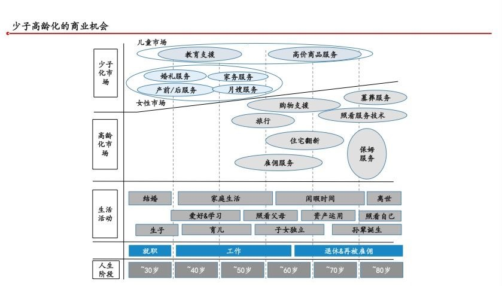
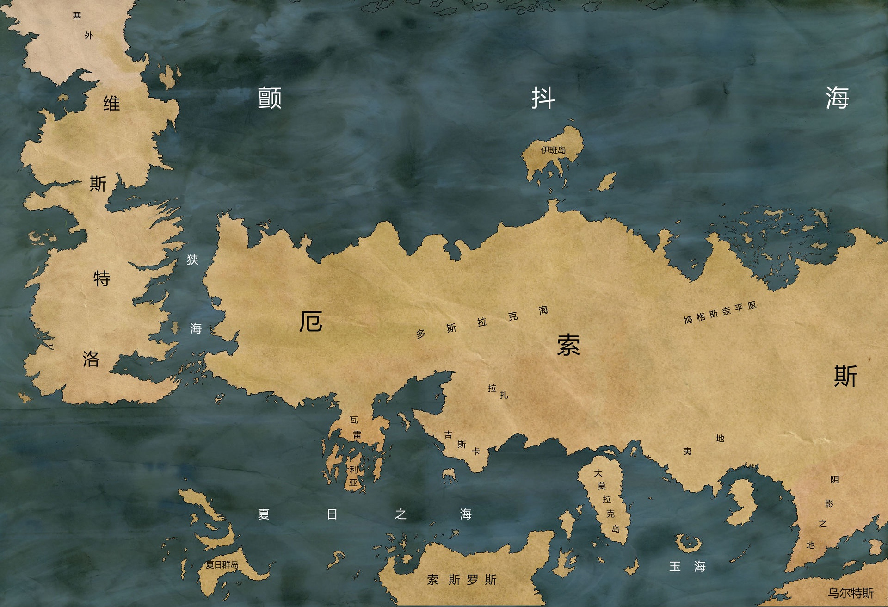

每周分享阅读过体验过的事物，更多详见[历史周刊内容](https://mp.weixin.qq.com/mp/appmsgalbum?__biz=MzIxNzI1OTMzMg==&action=getalbum&album_id=3088144283867512833)。

**1. 成为前5%的人**

在某个领域深耕过的人都知道，想要达到行业顶尖，往往要付出比优秀更多的努力。在这个日新月异的世界，死磕一个领域追求顶尖可能得不偿失。在你努力追赶的时候，你所在的领域可能已经发生了变化，所以你必须不断学习。从80分到90分，往往需要付出比从70分到80分更多的努力。努力到一定程度后，带来的边际效应就会递减。如果你想成为某个细分领域前5%的人，可能需要换种思路，增加你所精通的领域。

你在A领域前20%，在B领域前20%，A和B交叉的领域也许你可以排在前5%。这就是大家都在推崇复合型人才的原因。如果你能涉猎更多的领域，你可能会在多个领域交叉处有所创新，产生创造性的见解。这让我想起了《呆伯特》系列漫画的作者斯科特·亚当斯。

> 亚当斯说，如果你想在某个领域成为一个高手，你大概有两个选择。第一个选择是，你把自己的某个技能练到全世界最好。这个非常困难，极少人能做到。第二个选择是，你可以练习两到三项技能，再把每一项技能都练到世界前25%的水平，这就相对容易一些。而如果你能把这两项甚至三项技能结合起来去做一件事，就能取得了不起的成就。比如亚当斯自己。他的画画技能，写笑话技能，以及对“办公室政治”的了解，可能都不是全世界最好的，但是都能达到前25%的水平。于是他把这三项技能结合起来，就创作了“呆伯特漫画”。

工作分工提高了社会运转效率，但过度的专业化也让我们失去了对职业和生活的掌控感。人生是多元的，在生活中学习多种技能也能让生活更美好。科幻作家海因莱因写道：

> 一个人应该懂得如何更换尿布、策划战争、杀猪、开船、设计建筑、创作诗歌、算清账目、搬砖砌墙、接续断骨、安抚将死之人、听从命令、发布命令、与人合作、独断独行、解方程组、分析前所未见的问题、清理肮脏的畜栏、编写计算机程序、烹制美味佳肴、高效地战斗，并勇敢地死去。只有昆虫才专业化。

当你在工作和生活等方面遇到瓶颈时，不妨多去尝试一些新的领域，寻求在一些交叉的方面做出突破。一个人也许没法成为一个顶尖的程序员，但他可以成为一个优秀程序员、优秀产品经理、优秀写作者的组合，他同样可以用自己拥有的多重技能创造出优秀的作品。

相关阅读：

- [前25%法则：如何成为高手](https://mp.weixin.qq.com/s/V5nxO9yvs2HU9NR7Z8KB-w)

- [你也可以成为前5%的人](https://mp.weixin.qq.com/s/o5wN-H1aX-E9TfFHlQKbwA)

**2. 如何用沟通解决80%的工作问题**

沟通的本质是什么？是通过交流和解释来让对方理解自己的想法、情感和信息。就像是在两个人之间传递一个球。一个人将球（信息）扔给另一个人，另一个人接住球并理解它。这个过程就像是在交流思想、感情和信息。

可以用信息论来解释。首先你和对方都是信源，知识结构不一样，如何确保你说的对方能够听懂？你得说人话，找共同点。其次，信息传输是有损的，文字、语音、视频都对信息进行了压缩和解压，一定会有损耗，如果可以最好面对面交流。最后，每个人沟通都有自己的述求，要学会倾听对方的心声。「如果你想要说服别人，要诉诸利益，而非诉诸理性。」

相关阅读：

- [傅盛：如何用沟通解决80%的工作问题？一个CEO的几条沟通建议](https://mp.weixin.qq.com/s/Bpt4cIChMtl4GwcQ_fMAgw)

- [人和人沟通的关键是什么？](https://mp.weixin.qq.com/s/VuxKfjUagUBv32rv5x9AfA)

**3. 证明你能搞定困难的事**

我们都有畏惧困难的情绪，因为克服困难需要付出更多努力，而且可能不会成功。但是，这却是快速成长的重要原因。有些人做困难的事情是因为兴趣驱动，有些人则是迫于无奈，还有一些人是出于责任驱动。但不管是哪种原因，当我们愿意面对困难并承受它可能带来的失败后，困难就不那么可怕了。毕竟，除了死亡，我们还有什么需要畏惧的呢？

在招聘过程中，那些做过困难事情的简历往往更受欢迎。这些人能够脱颖而出，区别于只做常规任务的人。在面试中，候选人经常会被问到一个问题：“在你所做过的项目中，遇到过最难的技术问题是什么？”通过这个问题，面试官可以了解候选人的技术水平和解决问题的思路。这些并不一定要与岗位要求相关，但能证明他有能力去做困难的事。

包含数学专业背景、ACM获奖经历、业界明星项目经历以及独立完成复杂任务的简历往往更能获得青睐。这些经历证明了他们的能力，一个能证明你能做困难事情的项目顶得上多个常规任务。

不仅要去做困难的事情，还要做总结，这样才能获得问题定位的方法，知道当时为什么不愿意去克服它，总结出解决问题的过程并分享给团队和外部。随着你解决困难问题的增多，你与只做常规事情的人之间的差距会越来越大，最终将超越他们。

刚毕业时一位学长曾经寄语：“找到你所在技术领域的难点和重点，花费大量时间去单点突破它，分享它，不断地积累，它们终将铺就你的成功道路。”现在想来，真有道理。

相关阅读：[证明你能完成艰巨的任务](https://www.feishu.cn/docx/IlOldeTTWokN8RxokKRc7Lhvnpf)

**4. 从日本消费社会演变史窥见未来 20 年的中国**

中国和日本在地理、人口密度、城镇化发展水平等方面存在一定的相似性，因此日本的消费社会演变对中国未来零售业的发展具有参考价值。

日本消费社会经历了三个阶段：第一消费时代（1954-1971），大量生产、大量消费为特征；第二消费时代（1971-1991），个性化消费和品质追求为特点；第三消费时代（1991至今），简约、高性价比和精神文化消费为主导。

从日本消费演变历史来看，针对中国下沉市场，有两种解决方案：学习日本的堂吉诃德（线下版拼多多）和大创产业（下沉版名创优品）。对中国未来新零售的展望包括：7-11的全渠道模式和日本的药妆店模式。

另外，日本自90年代以来，在老龄化和少子化市场领域带来了商业机会，并催生了多个热门赛道。我们可以从中预测中国未来20年社会的发展趋势。

相关阅读：[日本消费社会演变史 —— 窥见未来 20 年的中国](https://mp.weixin.qq.com/s/P8wjD2iEF2bfGf2rVtEr5w)

**5. 为什么我们如此痴迷双卡双待**

痴迷双卡双待最重要的原因是省钱。

20世纪90年代，东部经济发达，用手机的人多，通信资费分摊下来成本更低。西部用户少，收不抵支，运营商于是建立了一个类似于买路费的漫游制度，东部往西部打电话的时候要给西部运营商交点钱。对手机用户来说，与其交漫游费，不如在常往来的城市多办一张电话卡。无数在外上学的大学生经历着家里一个号，学校一个号的生活；无数出差在外的社会人有过“先挂机了，话费很贵”的经历。一个手机两张卡，中国移动号发短信便宜，一个中国联通号打电话划算，把它们插进同一手机的需求也就愈发旺盛，双卡双待就这样成为了中国人的标配。

中国移动在电信业务上是早期介入者，但在3G时代，由于拿到了较差的TD-SCDMA牌照，网速慢，用户流失。后来在4G时代，中国移动抢先获得牌照，占据了大部分市场份额。中国联通和中国电信则后来获得了FDD-LTE牌照。在竞争激烈的环境中，中国电信采取了“绑手机、办宽带”的策略，成功突围。在运营商大战中，用户往往想既要保留老的号码，也要体验新的服务，所以常备多张卡。

那么，为什么偏偏中国人一人要用两张卡，外国人却不需要呢？因为外国人可以不换号码的前提下，换运营商，也就是携号转网。在节约号码资源的同时，也省得顾客频繁更换号码。但国内各大运营商套餐各出奇招，用签约绑定客户，硬是让你逃不出运营商的手掌心。崇尚实用主义的国人对双卡双待只不过是一种无奈的妥协。

相关阅读：[为什么中国如此痴迷双卡双待？](https://mp.weixin.qq.com/s/ZoPqCdgYwildZlWNI0muQQ)

**6. Google Maps的故事**

搜索引擎是对网络信息进行索引，而地图则是对现实世界进行索引。在互联网上，Google Maps无疑是最为著名的地图软件之一。它拥有许多创新性的功能，例如标记地点的大头针、多图层混合等。你是否好奇这些经典功能背后的故事？Google Maps团队在被Google收购之前经历了哪些波折？在被收购之后，这个团队如何在复杂的公司环境中生存并成长，最终打造出备受赞誉的地图产品？这些精彩内容都可以在《谷歌方法》这本书中找到。但是，如果觉得这本书太长，可以阅读余晟的《Google Maps的故事》，这篇文章将为你呈现这个引人入胜的故事，让你大快朵颐。

相关阅读：

- [Google Maps的故事](https://mp.weixin.qq.com/s/UCsoJLzdIfT-DaZ622dWOQ)

-  [《谷歌方法》](https://book.douban.com/subject/33430445/)

- [Wired长文：冷战苏联地图的秘密世界](https://mp.weixin.qq.com/s/7OxR8CPNiKmI_MMB8iuZEA)

**7. 如何才能长寿**

虽说活得精彩比获得长寿更重要，但如果既能活得精彩又能活得长久，想必你也不会拒绝。那么，如何才能长寿呢？国际长寿领域科学家路易杰·冯塔纳教授基于流行病学大数据，撰写了一本科学抗衰的书籍《长寿的活法》。书中系统介绍了衰老的控制、健康饮食、运动、社交关系和幸福感的重要性，以及如何通过改变生活方式来延长寿命和提高生活质量。

相关阅读：
- [看这篇文章能让你健康多活若干年](https://mp.weixin.qq.com/s/lV3usCCV918TduPvFCeS8Q) 
- [程序员延寿指南](https://github.com/geekan/HowToLiveLonger)

