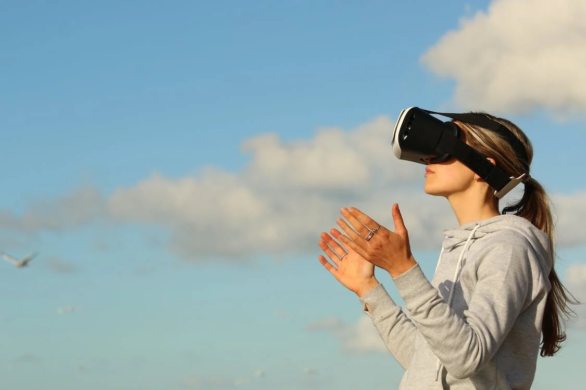
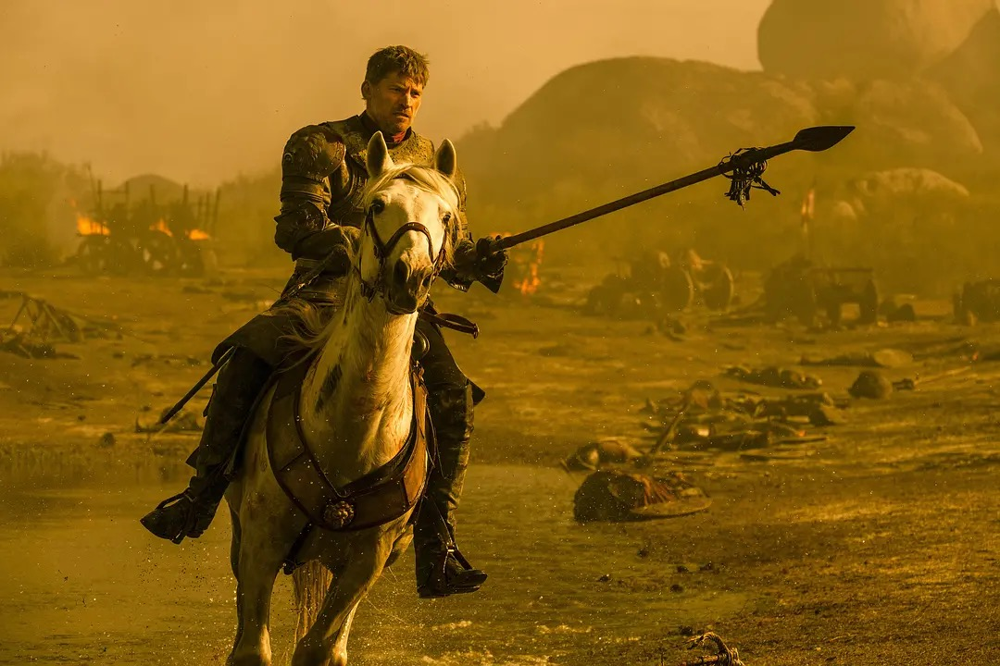
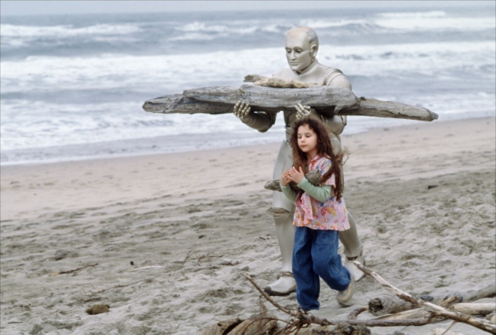
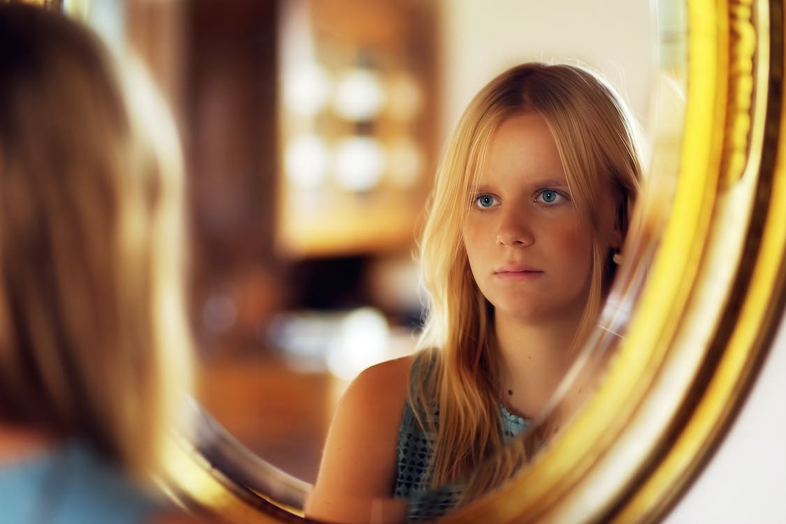
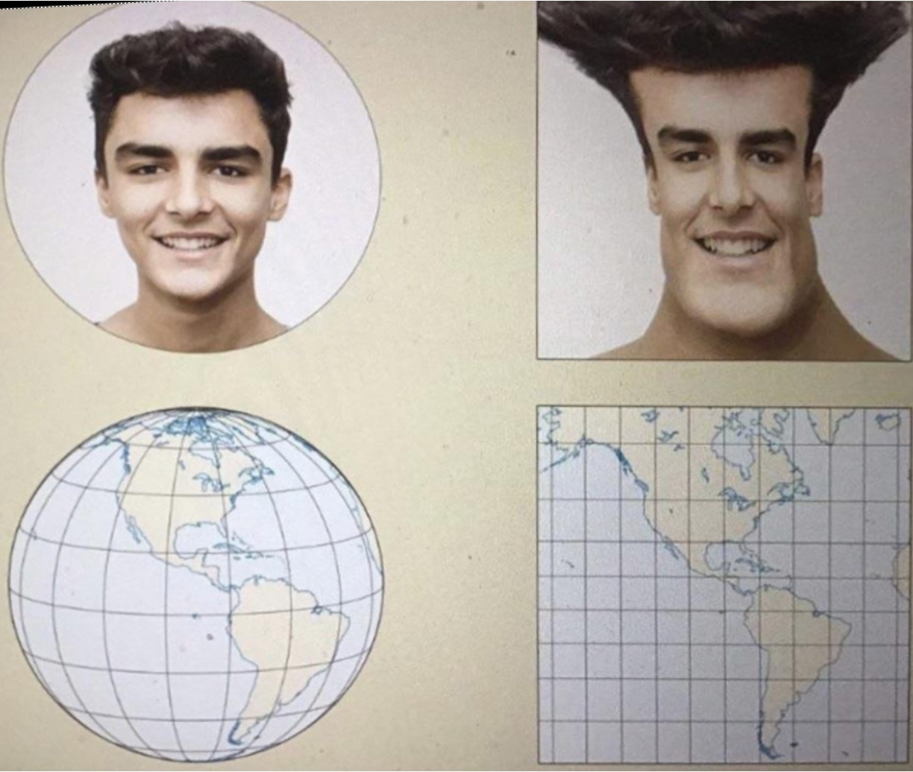
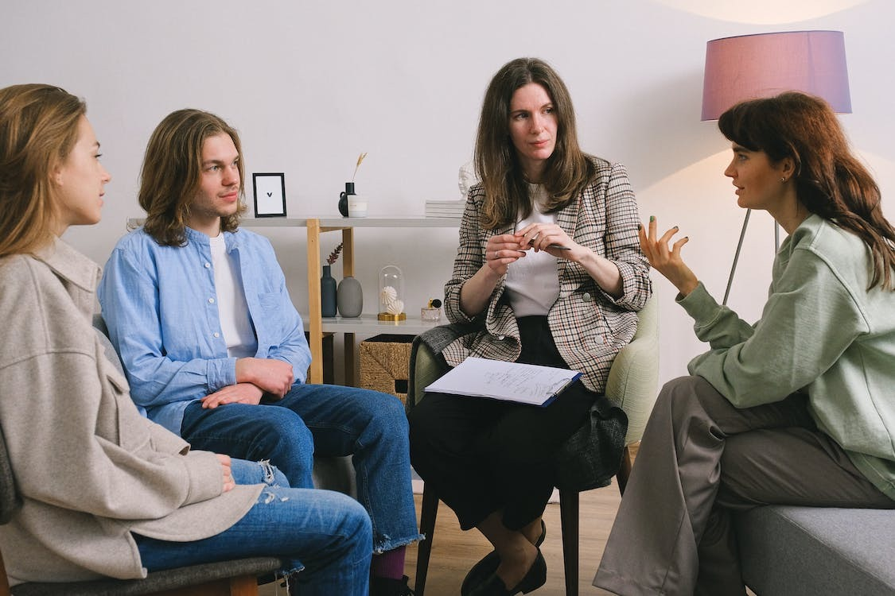

每周分享阅读过体验过的事物，更多详见[历史周刊内容](https://mp.weixin.qq.com/mp/appmsgalbum?__biz=MzIxNzI1OTMzMg==&action=getalbum&album_id=3088144283867512833)。

**1. 如何浪费时间**

不知道你有没有过这样的感觉：生命中的某些时间段是空白的，你回忆不起来自己做过什么，就好像这些时间被偷走了，浪费掉了，不再属于你。

短暂的娱乐活动会让我们很快感受到时间被浪费，但这种感觉并不持久。当我们意识到已经刷了半天的短视频，内心会涌现出警告的声音：“别再刷了，赶紧先做完事情。”这些警告会不断提醒我们，让我们在娱乐时感受到些许的不安，最终将我们从“堕落”的边缘拉回。

如果你在刷剧时能感受到快乐，那么时间并没有被浪费。真正浪费时间的是你没有在做自己想做的事情。把日程排得很满，开各种马拉松会议，参加一些无意义的社交，假装自己很忙碌，一段时间后回过头来看，你会发现自己如同行尸走肉般地忙活，你的内心会想：我到底在做什么？

时间是悬挂在每个人头上并且慢慢下坠的一把利剑，你不知道它何时会忽然加速地落下。能享受当下的美好自然是最好不过，但如果没有这样的时刻，不如多做一些自己想做的事，让当下的自己获得成长，为未来多创造一些美好。

相关阅读：

- [如何浪费时间和金钱](https://mp.weixin.qq.com/s/fyK0gp8rcaDnOJqfSAJFrw) 

- [这段无所事事的日子，是你人生的多少倒数格](https://mp.weixin.qq.com/s/c8QF2-g2dEq2mZPCTiskJQ)

**2. 你是你生活的主角**

在许多游戏中，我们都能遇到NPC，即非玩家角色。它们被设计出来，为玩家提供信息，推动游戏剧情的发展。这些NPC形态各异，有的固定不动，有的四处游荡，与玩家不期而遇。有的NPC背后有着感人的故事，有的则只是扮演售卖道具的角色。尽管它们可能具备一定的智能，但它们并不具备玩家的主体性，剧情的推进依然需要玩家的触发，玩家才是游戏中的主角。

如果将现实生活视作一场游戏，我们刚出生都是「主角」，慢慢地很多人沦落成为「配角」，甚至有些变成了NPC。之所以会成为NPC，是因为我们在现实生活中不断受到挫折，逐渐认识到自己的平庸，失去了追求梦想的勇气。NPC的人生轨迹是按照某种预设模式进行的，如上学、工作、结婚、生子、终老。这是社会主流为NPC 设定的「主线任务」。然而，在这个过程中，还有许多「支线任务」，可能比「主线任务」更加精彩，但大多数NPC却不会去追求，他们会认为那些是为人生游戏中的主角准备的，自己只是一个普通人。

要摆脱成为NPC的命运，我们需要主动地追求自己的目标，不要被社会默认的设定所束缚。在必要时，可以寻找捷径，甚至使用「作弊码」。因为你是你生活的主角，不是NPC。「无论风暴将我带到什么样的岸边，我都将以主人的身份上岸。」

相关阅读：

- [停止成为一个非玩家角色](https://www.feishu.cn/docx/AEN0domP5oW7ctxa2Fic8qRVn7g)

- [做一个快乐的NPC：别致且无穷的趣味](https://mp.weixin.qq.com/s/RJFTT0vWRg-EXkciY77vLA)

**3. 如何在数字时代更好地学习**

人们常常用累加性、累积性的思维来思考学习：如果我积累足够的信息，它最终会转化为知识。我们倾向于以物质的方式来理解世界，因此，如果数据是有形的，那么我们会合理地假设无限增长的信息记忆是可能的。我们消耗的信息越多，存储的信息也就越多，将来可以检索的信息数据也就越多。读的商业通讯越多，对商业的了解也就越深。

然而，不幸的是，人类的记忆并不像存储容器一样被动累积信息，学习也不是以这种方式发生的。事实上，只有在我们积极学习的过程中，我们才能记住信息。学习的内在努力不仅仅是核心活动的副产品，就像跑步时的呼吸急促一样。

在智能手机驱动的社会中，除了分享、点赞或转发之外，真正的参与从根本上变得困难——换句话说，不参与从根本上变得更容易。被动浏览令人上瘾：整个信息供应链是针对在应用程序中花费的时间进行优化的，而不是针对保留和主动性进行优化的。数字产品很容易让我们产生错觉，以为自己在学习，而实际上却在进行娱乐活动。

如果想长期吸收所遇到的事情，我们就需要积极参与其中，尽力避免自我欺骗。当我们对某项内容的参与是主动且努力的时，那么它就是学习；当我们只是被动地参与时，它就是娱乐。当我们进行创造时，我们正在学习；当我们只是消费时，我们只是在放松。

相关阅读： 

- [如何在数字时代更好地学习](https://www.feishu.cn/docx/KvxOdKeiIoG7aqxIjSxceL2wnVi)

- [《学习究竟是什么》笔记](https://sspai.com/post/65000)

**4. 什么时候AI才能帮我把麻烦事都做了？**

莫拉维克悖论指出，在人工智能领域，困难的问题往往易于解决，而简单的问题却难以解决。这意味着，对人类来说看似简单的事情，对人工智能而言可能非常困难。Marvin Minsky为此提供了一个解释：我们很难意识到自己最擅长的事情，却更容易意识到我们不擅长但较为简单的事情。从进化的角度来看，我们花费了数十亿年时间从猿猴进化为人类，又花费了几百万年的时间发展出语言、逻辑以及音乐和美术等技能。在这个时间轴上，我们花费了超过99%的时间与物理世界互动，熟悉物理世界的运动，而只花费了一丁点时间研究我们认为困难的问题。这可能是为什么我们和AI对困难和简单的定义存在差异。

你可能想要让机器人给你倒垃圾，做饭，洗衣服......那你需要的是通用具身人工智能。

要让通用具身人工智能进行学习，最好的老师是我们人类自己。当我们面对一个任务时，我们会首先使用视觉、触觉、听觉、嗅觉和味觉等感知模块来感知世界并收集信号。我们还需要使用所了解的世界模型进行分析。世界模型是描述世界运行规律的模型。它可以是你推理出如果垃圾不及时处理，就会引来不受欢迎的昆虫；也可以是你通过直觉和物理想象篮球出手时抛出的优雅抛物线。结合感知和世界模型，我们可以做出决策并采取行动。这种感知和行动的循环构成了闭环。

目前，我们已经能够让AI智能体具备感知、世界模型以及决策能力，并泛化到新任务。我们赋予身体智能，这就是我们现在定义的具身智能。

身体不仅承载智能，还能帮助我们发展智能。例如，大模型。大家可能知道ChatGPT是一种语言大模型，还有其他多模态大模型可以将视觉和语言融合在一起。这样的大模型有助于我们理解世界，使具身智能体更加通用。

当前的通用具身智能仍处于初级阶段，我们需要给予足够的关注和引导，使其最终能够成为我们希望的伙伴，陪伴、帮助和服务我们。

最后回到问题：什么时候AI才能帮助我们处理这些琐事？答案是：别着急，它正在向我们走来。

相关阅读：[到底什么时候AI才能帮我把麻烦事都做了啊啊啊啊？](https://mp.weixin.qq.com/s/DmHHn8pfrNIqgsoiBzLvfQ)

**5. 认识你自己*

人类正面临前所未有的各种变革，这些变革很可能改变人生的基本架构，使“不连续性”成为最显著的特征。

为了在这样的社会中生存，我们需要不断学习，不断重塑自身。最重要的是能够随机应变，学习新事物，在不熟悉的环境中保持心智平衡。虽然我们无法确定细节，但唯一能确定的就是一切都会改变。

人一生中的各个阶段可能会出现裂痕，不同时期的人生也不再紧密相连。“我是谁”会变成一个比以往更加紧迫也更加复杂的问题。人类将不得不一再放弃某些自己最熟悉的事物，并学会与未知和平相处。

其实我们也并不了解自己，当我们试图倾听自己内心的声音时，很容易受到外部的操控。我们大脑中的那些声音，并不值得信赖。

未来会发生什么我们不知道，我们能做的是认识自己，以不变应万变。

相关阅读：[《今日简史》赫拉利：稳定已是奢侈品，重要的是认识你自己](https://mp.weixin.qq.com/s/w7mc9EV0B91lvL5GqpMSjg)

**6. 地图扭曲了我们对世界的看法**

我们常见的地图，例如Google Maps和百度地图，都使用了墨卡托投影。墨卡托投影是一种圆柱投影，将地球想象成一个圆柱，然后将地球表面沿着经线切开，贴在圆柱的侧面，最后将圆柱展开成一个矩形。这种投影的优点在于，它保持了经纬线的直角交叉，也就是说，方向的一致性得以维持，这对于航海和导航具有很大的实用性。然而，这种投影也存在明显的缺点，它极大地扭曲了地球的面积和形状，特别是在靠近两极的地区。

可以看出，墨卡托投影使得格陵兰岛看起来与非洲同样大小（实际上，格陵兰岛的面积是216万平方公里，而非洲的面积是3022万平方公里，两者相差了14倍）。南极洲看起来像被无限延伸，加拿大和俄罗斯在地图上比实际要大得多，而赤道附近的国家则看起来比实际要小得多。

这造成了人们对世界的不准确理解。有人误以为中国和美国的面积相当，但实际上中国的面积要比美国大得多；有人以为欧洲和非洲的面积差不多，但实际上非洲的面积要比欧洲大得多；有人以为澳大利亚和南极洲的面积相当，但实际上澳大利亚的面积要比南极洲小得多。

墨卡托投影显然扭曲了我们对于世界的感知，但这并不是它唯一的扭曲方式。通常我们的地图以赤道和通过伦敦的参考子午线为中心，这使得我们忽略了诸多地区之间引人注目的关系。比如中国最西端比最东端更接近德国；阿拉斯加之所以拥有世界第三大机场在货运方面主要是因为它是北半球所有大市场的中心点。

总之，我们看到的各种世界地图都是一种近似和简化的表示。它们都有各自的优缺点，无法完全反映地球的真实情况。

相关阅读：

- [地图扭曲了我们对世界的看法](https://www.feishu.cn/docx/DWOCdPWZqod9Fix5adrccEY1nCe)

- [“眼见不一定为实”||关于地图投影的那些事](https://mp.weixin.qq.com/s/egLHjhd-aNKdIP435kJ9MQ)

-  [你看到的世界地图是错的](https://mp.weixin.qq.com/s/Og_g7nHDklO0owvugJpSWg)

**7. 我和孩子交换了人生**

很多时候，换个视角来看事物，会有不一样的效果。当你代入对方，感受 TA 的感受，站在 TA 的角度来看事物，很多问题都会迎刃而解。

相关阅读：[给你讲一个恐怖故事: 寒假，我和孩子交换了人生……](https://mp.weixin.qq.com/s/NwvJlBNuuIocbU1k0dko1g)

